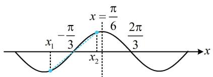

> [!faq]- 《第3节 四个常见条件的翻译》参考答案
>
> > [!success]- **【答案】** C
>
> > [!note]- **【分析】**
> > 本题未单列分析。
>
> > [!note]- **【解析】**
> > C
> > 解析： $f(x) \leq f\left(\frac{\pi}{6}\right) \Rightarrow x = \frac{\pi}{6}$ 是 $f(x)$ 的最大值点，
> > 又 $f(x)=\sin x+a\cos x=\sqrt{1+a^{2}}\sin(x+\varphi)$ ，所以 $f(x)$ 的最小正周期为 $2\pi$ ，有了这两点，就可以推断 $f(x)$ 图象上的对称轴、对称中心这些关键信息了。例如， $x=\frac{\pi}{6}$ 左侧的第一个对称中心是 $\left(-\frac{\pi}{3},0\right)$ ，右侧的第一个对称中心是 $\left(\frac{2\pi}{3},0\right)$ ，如图，因为 $f(x)$ 在 $[x_{1},x_{2}]$ 上单调，
> > 且 $f(x_{1})+f(x_{2})=0$ ，所以 $x=\frac{x_{1}+x_{2}}{2}$ 处必为对称中心，
> > 当 $\left|x_{1}+x_{2}\right|$ 最小时， $\left|\frac{x_{1}+x_{2}}{2}\right|$ 也最小，所以只需找到横坐标绝对值最小的那个对称中心，
> > 由图可知， $\left(-\frac{\pi}{3},0\right)$ 这个对称中心的横坐标的绝对值最小，
> > 所以 $\left|\frac{x_{1}+x_{2}}{2}\right|_{\min}=\frac{\pi}{3}$ ，故 $\left|x_{1}+x_{2}\right|_{\min}=\frac{2\pi}{3}$ .
> >
> > 
> >
> > 一数·必刷100讲
