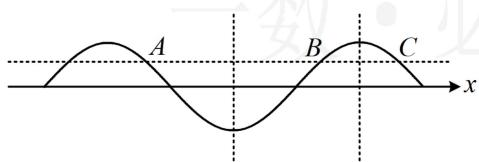
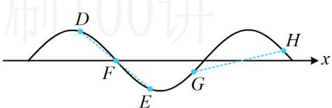
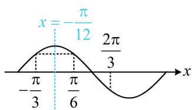
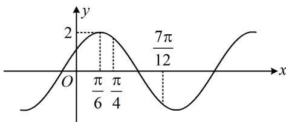

<!-- source-part:1 pages:1-3 -->

# 第3节 四个常见条件的翻译（★★★）

## 内容提要

本节归纳 $y = A \sin (\omega x + \varphi)$ 这类函数的图象性质有关考题中常见的四个条件的翻译方法.

1. 单调区间：从左到右，最大值点到相邻最小值点为减区间，最小值点到相邻最大值点为增区间。当条件给出在某区间单调时，则该区间不超过半个周期。

2. 函数值相等: 一个周期内 (若恰好为一个周期, 则结论不一定成立), 两个点的函数值相等, 则它们中间必为对称轴; 如图 1 中同周期内的 $A$ , $B$ 两点处函数值相等, 则中间为对称轴; 又如同周期内的 $B$ , $C$ 两点处函数值相等, 中间也为对称轴; $A$ , $C$ 之间恰好为一个周期, 它们的中间不是对称轴;

3. 函数值相反: 半个周期内 (不包括恰好为半个周期) 或同一段单调区间上, 两个点的函数值相反, 则它们中点必为对称中心. 如图 2 中的 $D$ , $E$ 两点在半个周期内 (也在同一段单调区间上), 函数值相反, 所以它们的中点 $F$ 为对称中心; $G$ 和 $H$ 之间恰好为半个周期 (不在同一段单调区间上), 它们的中点不是对称中心.

4. 隐含的最值点: 若 $f(x) \leq f(x_0)$ , 则 $f(x)$ 在 $x = x_0$ 处取得最大值; 若 $f(x) \geq f(x_0)$ , 则 $f(x)$ 在 $x = x_0$ 处取得最小值; 若 $f(x) \leq |f(x_0)|$ , 则 $f(x)$ 在 $x = x_0$ 处取得最值 (最大值、最小值均可).

  
图1

  
图2

【例1】若函数 $f(x) = \sin \left( \omega x + \frac{7\pi}{12} \right)$ 在 $\left[ \frac{\pi}{6}, \frac{2\pi}{3} \right]$ 上单调，且 $f\left( -\frac{\pi}{3} \right) = f\left( \frac{\pi}{6} \right)$ ，则正数 $\omega$ 的值为 \_\_\_\_. 解析：给出了在某区间单调的条件，根据内容提要1，可由此限定周期 $T$ 的范围，进而得到 $\omega$ 的范围，因为 $f(x)$ 在 $\left[ \frac{\pi}{6}, \frac{2\pi}{3} \right]$ 上单调，所以 $\frac{T}{2} \geq \frac{2\pi}{3} - \frac{\pi}{6} = \frac{\pi}{2}$ ，从而 $T = \frac{2\pi}{\omega} \geq \pi$ ，故 $0 < \omega \leq 2$ ①，

另一条件 $f\left(-\frac{\pi}{3}\right) = f\left(\frac{\pi}{6}\right)$ 涉及函数值相等，尝试用它分析对称轴，先看看它们是否在一个周期内，

由 $T \geq \pi$ 知 $-\frac{\pi}{3}$ 和 $\frac{\pi}{6}$ 在同一个周期内，又 $f\left(-\frac{\pi}{3}\right) = f\left(\frac{\pi}{6}\right)$ ，所以它们的中间 $x = -\frac{\pi}{12}$ 必为对称轴，如图，所以 $-\frac{\pi}{12}\omega + \frac{7\pi}{12} = k\pi + \frac{\pi}{2}$ ，从而 $\omega = 1 - 12k (k \in \mathbf{Z})$ ，结合①可得 $k$ 只能取0，故 $\omega = 1$ 。

答案: 1

【反思】对于 $f(x)=A\sin(\omega x+\varphi)$ 这类函数，①若 $f(x)$ 在某区间单调，则该区间的宽度不超过半个周期；②若 $f(x_{1})=f(x_{2})$ ，且 $x_{1}$ ， $x_{2}$ 在同一周期内（不恰好为一个周期），则可推断 $x=\frac{x_{1}+x_{2}}{2}$ 为对称轴.

【例2】函数 $f(x) = 2\sin (\omega x + \varphi)(\omega >0)$ 的部分图象如图，

若 $f\left(\frac{\pi}{4}\right) + f\left(\frac{7\pi}{12}\right) = 0$ ，则 $f\left(\frac{\pi}{12}\right) = (\quad)$ A. $\frac{\sqrt{2}}{2}$ B. $\frac{\sqrt{3}}{2}$ C. $\sqrt{2}$ D. $\sqrt{3}$

解析：先观察最值点、零点这些关键点，图中只标注了 $x = \frac{\pi}{6}$ 处为最大值点，仅由此无法求出周期，但可根据 $f\left(\frac{\pi}{4}\right) + f\left(\frac{7\pi}{12}\right) = 0$ 推断出 $\frac{\pi}{4}$ 和 $\frac{7\pi}{12}$ 的中间应为对称中心，从而求得周期，由图可知 $\frac{\pi}{4}$ 和 $\frac{7\pi}{12}$ 在同一段单调区间上，又 $f\left(\frac{\pi}{4}\right) + f\left(\frac{7\pi}{12}\right) = 0$ ，所以 $\left(\frac{5\pi}{12},0\right)$ 是图象的一个对称中心，从而 $\frac{5\pi}{12} -\frac{\pi}{6} = \frac{T}{4}$ ，故 $T = \pi$ ，所以 $\omega = \frac{2\pi}{T} = 2$ ，还需求 $\varphi$ ，可代 $x = \frac{\pi}{6}$ 这个最大值点，又 $f\left(\frac{\pi}{6}\right) = 2\sin \left(2\times \frac{\pi}{6} +\varphi\right) = 2$ ，所以 $\sin \left(\frac{\pi}{3} +\varphi\right) = 1$ ，从而 $\frac{\pi}{3} +\varphi = 2k\pi +\frac{\pi}{2}$ ，故 $\varphi = 2k\pi +\frac{\pi}{6}(k\in \mathbf{Z})$ 所以 $f(x) = 2\sin \left(2x + 2k\pi +\frac{\pi}{6}\right) = 2\sin \left(2x + \frac{\pi}{6}\right)$ ，故 $f\left(\frac{\pi}{12}\right) = 2\sin \left(2\times \frac{\pi}{12} +\frac{\pi}{6}\right) = 2\sin \frac{\pi}{3} = \sqrt{3}.$

答案: D

【反思】看到 $f(x_{1}) + f(x_{2}) = 0$ ，先分析 $x_{1}$ ， $x_{2}$ 是否在同一段单调区间上或同在半个周期内，若是，则可推断 $x = \frac{x_{1} + x_{2}}{2}$ 处为对称中心。

【例3】设函数 $f(x) = \sin (\omega x + \varphi)\left(\omega > 0, \left|\varphi\right| < \frac{\pi}{2}\right)$ 满足 $f(0) = \frac{1}{2}$ ， $f(x) \leq \left|f\left(\frac{\pi}{10}\right)\right|$ ，且 $f(x)$ 在 $\left(\frac{\pi}{6}, \frac{\pi}{3}\right)$ 上单调，则 $\omega =$ \_\_\_\_.解析：由题意， $f(0) = \sin \varphi = \frac{1}{2}$ ，又 $|\varphi| < \frac{\pi}{2}$ ，所以 $-\frac{\pi}{2} < \varphi < \frac{\pi}{2}$ ，故 $\varphi = \frac{\pi}{6}$ ， $f(x) = \sin \left(\omega x + \frac{\pi}{6}\right)$ ，再求 $\omega$ ，需要建立 $\omega$ 的通解，怎样建立？观察发现有 $f(x) \leq \left|f\left(\frac{\pi}{10}\right)\right|$ 这一条件，由内容提要4，可将其翻译为 $x = \frac{\pi}{10}$ 是 $f(x)$ 的最值点，因为 $f(x) \leq \left|f\left(\frac{\pi}{10}\right)\right|$ ，所以 $\frac{\pi}{10}\omega + \frac{\pi}{6} = k\pi + \frac{\pi}{2}$ ，故 $\omega = 10k + \frac{10}{3}(k \in \mathbf{Z})$ ①，我们发现只要 $k$ 取自然数，就能满足 $\omega > 0$ ，那 $k$ 能取所有的自然数吗？还有 $f(x)$ 在 $\left(\frac{\pi}{6}, \frac{\pi}{3}\right)$ 上单调这个条件没用过，单调意味着区间宽度不超过半个周期，于是可用它限定 $\omega$ 的范围，结合①筛选 $k$ 的值，由 $f(x)$ 在 $\left(\frac{\pi}{6}, \frac{\pi}{3}\right)$ 上单调可得 $\frac{\pi}{3} - \frac{\pi}{6} \leq \frac{T}{2}$ ，所以 $T \geq \frac{\pi}{3}$ ，即 $\frac{2\pi}{\omega} \geq \frac{\pi}{3}$ ，故 $\omega \leq 6$ ，又 $\omega > 0$ ，所以 $0 < \omega \leq 6$ ，结合①可得 $k$ 只能取0，此时 $\omega = \frac{10}{3}$ .答案： $\frac{10}{2}$

![[高中/总复习/教辅/一数常规版2026/第4章 三角函数/模块3：三角函数的图象性质/第3节 四个常见条件的翻译/强化训练/强化训练.md]]
