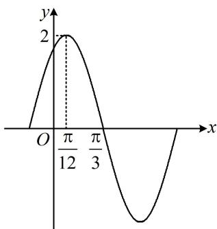

<!-- question-source:start -->
已知 $f(x) = A\sin (\omega x + \varphi)\left(A > 0,\omega >0,0 <   \varphi <  \frac{\pi}{2}\right)$ 的部分图象如图所示，则（）A. $A = 2$ B. $f(x)$ 的最小正周期为 $\pi$ C. $f(x)$ 在 $\left(-\frac{5\pi}{12},\frac{5\pi}{6}\right)$ 内有3个极值点D. $f(x)$ 在区间 $\left[\frac{11\pi}{6},2\pi \right]$ 上的最大值为 $\sqrt{3}$

<!-- question-source:end -->

![[Q00050839A1]]
