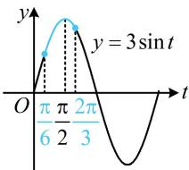

> [!faq]- 《第4节 整体换元法的应用》参考答案
>
> > [!success]- **【答案】** D
>
> > [!note]- **【分析】**
> > 本题未单列分析。
>
> > [!note]- **【解析】**
> > D
> > 解析：由题意， $f(x)$ 的最小正周期 $T=\frac{2\pi}{\omega}=\pi\Rightarrow\omega=2$ ，
> > 所以 $f(x)=3\sin\left(2x+\frac{\pi}{3}\right)$ ，令 $t=2x+\frac{\pi}{3}$ ，则 $f(x)=3\sin t$ ，
> > 当 $x \in \left[-\frac{\pi}{12}, \frac{\pi}{6}\right]$ 时， $t \in \left[\frac{\pi}{6}, \frac{2\pi}{3}\right]$ ，如图， $f(x)_{\min}=3\sin\frac{\pi}{6}=\frac{3}{2}$
> >
> > 
