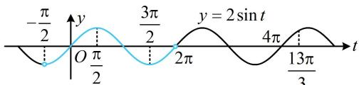
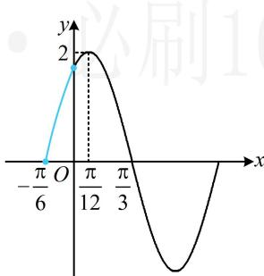

> [!faq]- 《第4节 整体换元法的应用》参考答案
>
> > [!success]- **【答案】** ABD
>
> > [!note]- **【分析】**
> > 本题未单列分析。
>
> > [!note]- **【解析】**
> > ABD
> >
> > 解法1：A项，由所给图象可知 $f(x)$ 的最大值为2，所以 $\vert A\vert = 2$ ，结合 $A > 0$ 可得 $A = 2$ ，故A项正确；
> >
> > B项，所给图象中有相邻的最大值点和零点，由此可推断周期，
> >
> > 由所给图象可知， $\frac{\pi}{3} -\frac{\pi}{12} = \frac{1}{4} T\Rightarrow T = \pi$ ，故B项正确；
> >
> > C项，研究 $f(x)$ 的区间极值点个数，可先求其解析式，还差 $\omega$ 和 $\varphi$ ，其中 $\omega$ 可由 $T$ 求得， $\varphi$ 可通过代最值点来求， $T = \frac{2\pi}{\omega} = \pi \Rightarrow \omega = 2$ ，结合 $A = 2$ 得 $f(x) = 2\sin (2x + \varphi)$ ，
> >
> > 由所给图象可知， $f\left(\frac{\pi}{12}\right) = 2\sin \left(2\times \frac{\pi}{12} +\varphi\right)$
> >
> > $= 2\sin \left(\frac{\pi}{6} +\varphi\right) = 2$ ，所以 $\sin \left(\frac{\pi}{6} +\varphi\right) = 1$
> >
> > 从而 $\varphi = \frac{\pi}{3} + 2k\pi (k \in \mathbf{Z})$ ，结合 $0 < \varphi < \frac{\pi}{2}$ 可得 $k$ 只能取 0，此时 $\varphi = \frac{\pi}{3}$ ，故 $f(x) = 2\sin \left(2x + \frac{\pi}{3}\right)$ ，
> >
> > 要由此分析 $f(x)$ 在 $\left(-\frac{5\pi}{12},\frac{5\pi}{6}\right)$ 上的极值点个数，可将 $2x + \frac{\pi}{3}$ 换元成 $t$ ，借助 $y = 2\sin t$ 的图象来分析，
> >
> > 设 $t = 2x + \frac{\pi}{3}$ ，则 $f(x) = 2\sin t$ ，当 $x \in \left(-\frac{5\pi}{12}, \frac{5\pi}{6}\right)$ 时， $t \in \left(-\frac{\pi}{2}, 2\pi\right)$ ，所以如图1中蓝色那段，
> >
> > $y = 2\sin t$ 在 $\left(-\frac{\pi}{2}, 2\pi\right)$ 上有 2 个极值点，所以 $f(x)$ 在 $\left(-\frac{5\pi}{12}, \frac{5\pi}{6}\right)$ 上也有 2 个极值点，故 C 项错误；
> >
> >   
> > 图1
> >
> > D项，研究 $f(x)$ 在 $\left[\frac{11\pi}{6}, 2\pi\right]$ 上的最大值，也可沿用前面的换元，借助 $y = 2\sin t$ 的图象来分析，
> >
> > 当 $x \in \left[\frac{11\pi}{6}, 2\pi\right]$ 时， $t \in \left[4\pi, \frac{13\pi}{3}\right]$ ，
> >
> > 由图1可知当 $t = \frac{13\pi}{3}$ 时， $y$ 取得最大值，
> >
> > $$
> > f (x) _ {\max} = 2 \sin \frac {1 3 \pi}{3} = 2 \sin \left(4 \pi + \frac {\pi}{3}\right) = 2 \sin \frac {\pi}{3}
> > $$
> >
> > $$
> > = 2 \times \frac {\sqrt {3}}{2} = \sqrt {3}
> > $$
> >
> > ## 解法 2: A、B 两项的分析同解法 1, 对于 C 项, 能否不求
> >
> > $f(x)$ 的解析式，直接判断呢？可以，注意到已有周期 T，而相邻极值点之间的距离为 $\frac{T}{2}$ ，故可直接结合所给图象中 $\frac{\pi}{12}$ 为极值点去推断它两边的其它极值点，
> > 由 $T = \pi$ 得 $\frac{T}{2} = \frac{\pi}{2}$ ，所以 $\frac{\pi}{12}$ 左边的极值点依次为 $-\frac{5\pi}{12}$ ， $-\frac{11\pi}{12}$ ，…，
> > 同理， $\frac{\pi}{12}$ 右边的极值点依次为 $\frac{7\pi}{12}$ ， $\frac{13\pi}{12}$ ，…，
> > 因为 $\frac{7\pi}{12}<\frac{5\pi}{6}<\frac{13\pi}{12}$ ，所以 $f(x)$ 在 $\left(-\frac{5\pi}{12},\frac{5\pi}{6}\right)$ 上的极值点只有 $\frac{\pi}{12}$ ， $\frac{7\pi}{12}$ 两个，故 C 项错误；
> > 对于 D 项，也可借助 $f(x)$ 的周期为 $\pi$ ，把 $\left[\frac{11\pi}{6},2\pi\right]$ 上的最大值转化到所给的那段图象上来分析，
> > 因为 $f(x)$ 的周期为 $\pi$ ，所以 $f(x)$ 在 $\left[\frac{11\pi}{6},2\pi\right]$ 上的最大值与 $f(x)$ 在 $\left[-\frac{\pi}{6},0\right]$ 上的最大值相同，
> > 因为极大值点 $\frac{\pi}{12}$ 左边的相邻零点为 $\frac{\pi}{12}-\frac{T}{4}=\frac{\pi}{12}-\frac{\pi}{4}=-\frac{\pi}{6}$ ，所以如图 2， $f(x)$ 在 $\left[-\frac{\pi}{6},0\right]$ 上 ↗，
> > 从而 $f(x)_{\max}=f(0)=2\sin\frac{\pi}{3}=2\times\frac{\sqrt{3}}{2}=\sqrt{3}$ ，故 D 项正确.
> >
> >   
> > 图2
