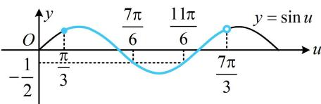

> [!faq]- 《第4节 整体换元法的应用》参考答案
>
> > [!success]- **【答案】** 详见解析
>
> > [!note]- **【分析】**
> > 本题未单列分析。
>
> > [!note]- **【解析】**
> > 解：（1） $f(t)=10-\sqrt{3}\cos\frac{\pi}{12}t-\sin\frac{\pi}{12}t=10-2\sin\left(\frac{\pi}{12}t+\frac{\pi}{3}\right)$
> >
> > 所以 $f(t)$ 的最小正周期为 $T = \frac{2\pi}{\frac{\pi}{12}} = 24$ ，实验室这一天的最大温差为 $f(t)_{\mathrm{max}} - f(t)_{\mathrm{min}} = 12 - 8 = 4^{\circ}\mathrm{C}$
> >
> > （2）（高于 $11^{\circ}\mathrm{C}$ 就需要降温，故令 $f(t) > 11$ 求 $t$ 的范围）由 $f(t) = 10 - 2\sin \left(\frac{\pi}{12} t + \frac{\pi}{3}\right) > 11$ 得 $\sin \left(\frac{\pi}{12} t + \frac{\pi}{3}\right) < -\frac{1}{2}$ ①，（要由此求 $t$ 的范围，可将 $\frac{\pi}{12} t + \frac{\pi}{3}$ 换元来看）令 $u = \frac{\pi}{12} t + \frac{\pi}{3}$ ，则不等式①即为 $\sin u < -\frac{1}{2}$ ，且当 $t \in [0,24)$ 时， $u = \frac{\pi}{12} t + \frac{\pi}{3} \in \left[\frac{\pi}{3}, \frac{7\pi}{3}\right)$ ，如图，当且仅当 $\frac{7\pi}{6} < u < \frac{11\pi}{6}$ 时， $\sin u < -\frac{1}{2}$ ，所以 $\frac{7\pi}{6} < \frac{\pi}{12} t + \frac{\pi}{3} < \frac{11\pi}{6}$ ，解得： $10 < t < 18$ ，
> >
> > 故在 10 时到 18 时，实验室需要降温.
> >
> > 
> >
> > ## 类型Ⅱ：含参的单调性相关问题
