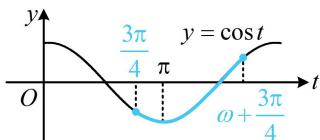

> [!faq]- 《第4节 整体换元法的应用》参考答案
>
> > [!success]- **【答案】** C
>
> > [!note]- **【分析】**
> > 本题未单列分析。
>
> > [!note]- **【解析】**
> > C
> > 解析：直接用 $f(x)$ 的图象来分析不方便，可将 $\omega x + \frac{3\pi}{4}$ 换元成 t，转化为用 $y = \cos t$ 的图象来看，令 $t = \omega x + \frac{3\pi}{4}$ ，则 $f(x) = \cos t$ ，当 $x \in (0,1)$ 时， $t \in \left( \frac{3\pi}{4}, \omega + \frac{3\pi}{4} \right)$ ，函数 $y = \cos t$ 的部分图象如图所示，
> > 由图可知 $y = \cos t$ 从 $t = \frac{3\pi}{4}$ 开始必定先 $\searrow$ ,
> > 从而 $f(x)$ 在 $(0,1)$ 上必定也要先 $\searrow$ ，故 C 项错误.
> >
> > 
