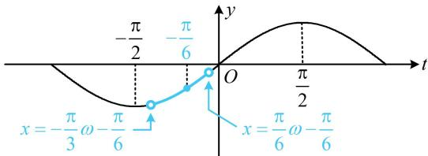

> [!faq]- 《第4节 整体换元法的应用》参考答案
>
> > [!success]- **【答案】** (0,1]
>
> > [!note]- **【分析】**
> > 本题未单列分析。
>
> > [!note]- **【解析】**
> > 解析：为了便于分析，先将 $\omega x - \frac{\pi}{6}$ 换元成 $t$ ，用 $y = \sin t$ 的图象来研究问题，设 $t = \omega x - \frac{\pi}{6}$ ，则 $f(x) = \sin t$ 当 $x\in \left(-\frac{\pi}{3},\frac{\pi}{6}\right)$ 时， $t\in \left(-\frac{\pi}{3}\omega -\frac{\pi}{6},\frac{\pi}{6}\omega -\frac{\pi}{6}\right)$
> >
> > 问题等价于函数 $y = \sin t$ 在 $\left(-\frac{\pi}{3}\omega - \frac{\pi}{6}, \frac{\pi}{6}\omega - \frac{\pi}{6}\right)$ 上单调，
> >
> > 该区间中必有 $-\frac{\pi}{6}$ ，如图，要使 $y = \sin t$ 在该区间单调，则该区间的左端点不能越过 $-\frac{\pi}{2}$ ，右端点不能越过 $\frac{\pi}{2}$ ，所以 $\left\{ \begin{array}{l} -\frac{\pi}{3}\omega - \frac{\pi}{6} \geq -\frac{\pi}{2} \\ \frac{\pi}{6}\omega - \frac{\pi}{6} \leq \frac{\pi}{2} \end{array} \right.$ ，结合 $\omega > 0$ 解得： $0 < \omega \leq 1$ 。
> >
> > 
