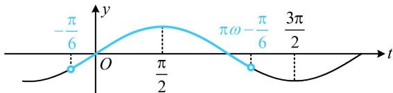

> [!faq]- 《第4节 整体换元法的应用》参考答案
>
> > [!success]- **【答案】** (2022·江西南昌模拟·★★☆) 若 $f(x) = \sin \left(\omega x - \frac{\pi}{6}\right)(\omega > 0)$ 在 $(0, \pi)$ 上恰有1个极大值点，无极小值点，则 $\omega$ 的取值范围为 \_\_\_\_. $$ \left(\frac {2}{3}, \frac {5}{3} \right] $$
>
> > [!note]- **【分析】**
> > 本题未单列分析。
>
> > [!note]- **【解析】**
> > 解析：直接画 $f(x)$ 的图象来分析不便，可先将 $\omega x - \frac{\pi}{6}$ 换元成 $t$ ，用 $y = \sin t$ 的图象来分析问题，设 $t = \omega x - \frac{\pi}{6}$ ，则 $f(x) = \sin t$ ，当 $x\in (0,\pi)$ 时， $t\in \left(-\frac{\pi}{6},\pi \omega -\frac{\pi}{6}\right)$ ，所以问题等价于 $y = \sin t$ 在 $\left(-\frac{\pi}{6},\pi \omega -\frac{\pi}{6}\right)$ 上有1个极大值点，无极小值点，如图，右端点 $\pi \omega -\frac{\pi}{6}$ 应在 $\frac{\pi}{2}$ （不可取）和 $\frac{3\pi}{2}$ （可取）之间，所以 $\frac{\pi}{2} <  \pi \omega -\frac{\pi}{6}\leq \frac{3\pi}{2}$ ，解得： $\frac{2}{3} <  \omega \leq \frac{5}{3}$
> >
> > 
