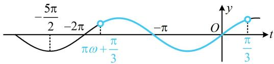
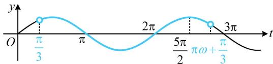

> [!faq]- 《第4节 整体换元法的应用》参考答案
>
> > [!success]- **【答案】** C
>
> > [!note]- **【分析】**
> > 本题未单列分析。
>
> > [!note]- **【解析】**
> > ## 11. (2022·全国甲卷·★★★)
> >
> > 设函数 $f(x) = \sin \left(\omega x + \frac{\pi}{3}\right)$ 在区间 $(0, \pi)$ 恰有三个极值点、两个零点，则实数 $\omega$ 的取值范围是（）A. $\left[\frac{5}{3}, \frac{13}{6}\right)$ B. $\left[\frac{5}{3}, \frac{19}{6}\right)$ C. $\left(\frac{13}{6}, \frac{8}{3}\right)$ D. $\left(\frac{13}{6}, \frac{19}{6}\right]$
> >
> > 解析：本题没有规定 $\omega$ 的正负，但结合选项，可以只考虑 $\omega > 0$ 的情形，但这里我们把 $\omega \leq 0$ 的情况也来做个分析，弄明白为什么 $\omega \leq 0$ 不满足题意，当 $\omega = 0$ 时， $f(x) = \sin \frac{\pi}{3} = \frac{\sqrt{3}}{2}$ ，显然不合题意；当 $\omega < 0$ 时，方便起见，先将 $\omega x + \frac{\pi}{3}$ 换元成 $t$ ，利用 $y = \sin t$ 的图象来分析问题，设 $t = \omega x + \frac{\pi}{3}$ ，则 $f(x) = \sin t$ ，当 $x \in (0, \pi)$ 时， $t \in \left( \pi \omega + \frac{\pi}{3}, \frac{\pi}{3} \right)$ ，如图1，在 $y = \sin t$ 在 $\left( \pi \omega + \frac{\pi}{3}, \frac{\pi}{3} \right)$ 上有2个零点的条件下，则极值点最多也只有2个，不可能满足题意；当 $\omega > 0$ 时，因为 $x \in (0, \pi)$ ，所以 $t \in \left( \frac{\pi}{3}, \pi \omega + \frac{\pi}{3} \right)$ ，函数 $f(x)$ 在 $(0, \pi)$ 恰有三个极值点、两个零点等价于 $y = \sin t$ 在 $\left( \frac{\pi}{3}, \pi \omega + \frac{\pi}{3} \right)$ 恰有三个极值点、两个零点，如图2，右端点 $\pi \omega + \frac{\pi}{3}$ 应在 $\frac{5\pi}{2}$ (不可取)和 $3\pi$ (可取)之间，
> >
> > 所以 $\frac{5\pi}{2} < \pi \omega + \frac{\pi}{3} \leq 3\pi$ ，解得： $\frac{13}{6} < \omega \leq \frac{8}{3}$ ，
> >
> > 故实数 $\omega$ 的取值范围是 $\left(\frac{13}{6},\frac{8}{3}\right]$ .
> >
> > 
> >
> > 图1  
> >   
> > 图2
