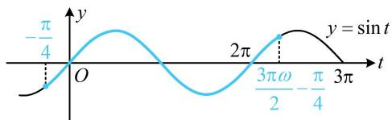

> [!faq]- 《第4节 整体换元法的应用》参考答案
>
> > [!success]- **【答案】** 详见解析
>
> > [!note]- **【分析】**
> > 本题未单列分析。
>
> > [!note]- **【解析】**
> > 解：（1）（研究 $f(x)$ 在 $\left[0, \frac{3\pi}{2}\right]$ 上的零点个数，可考虑将
> >
> > $\omega x - \frac{\pi}{4}$ 换元成 t，借助 $y = \sin t$ 的图象来分析）
> >
> > 令 $t = \omega x - \frac{\pi}{4}$ ，则 $f(x) = \sin t$ ，当 $x\in \left[0,\frac{3\pi}{2}\right]$ 时，
> >
> > $t \in \left[-\frac{\pi}{4}, \frac{3\pi\omega}{2} - \frac{\pi}{4}\right]$ ，所以 $f(x)$ 在 $\left[0, \frac{3\pi}{2}\right]$ 上有 3 个零点等价于 $y = \sin t$ 在 $\left[-\frac{\pi}{4}, \frac{3\pi\omega}{2} - \frac{\pi}{4}\right]$ 上有 3 个零点，
> >
> > 如图，应有 $2\pi \leq \frac{3\pi\omega}{2} -\frac{\pi}{4} < 3\pi$ ，解得： $\frac{3}{2}\leq \omega <  \frac{13}{6}$
> >
> > 又因为 $\omega$ 为正整数，所以 $\omega = 2$ ，故 $f(x) = \sin \left(2x - \frac{\pi}{4}\right)$
> >
> > （2）由题意， $g(x)=f\left(x+\frac{\pi}{4}\right)=\sin\left[2\left(x+\frac{\pi}{4}\right)-\frac{\pi}{4}\right]$
> >
> > $= \sin \left(2x + \frac{\pi}{4}\right)$ ，所以 $F(x) = \frac{g(x)}{f(x)} = \frac{\sin\left(2x + \frac{\pi}{4}\right)}{\sin\left(2x - \frac{\pi}{4}\right)}$ ①，
> >
> > (角不统一, 不易求单调区间, 怎么办呢? 观察发现 $2 x -$
> >
> > $\frac{\pi}{4} = \left(2x + \frac{\pi}{4}\right) - \frac{\pi}{2}$ ，故按此配凑，用诱导公式化简，即可统一角度） $\sin \left(2x - \frac{\pi}{4}\right) = \sin \left[\left(2x + \frac{\pi}{4}\right) - \frac{\pi}{2}\right] = -\cos \left(2x + \frac{\pi}{4}\right)$ ，
> >
> > 代入①得 $F(x) = \frac{\sin\left(2x + \frac{\pi}{4}\right)}{-\cos\left(2x + \frac{\pi}{4}\right)} = -\tan \left(2x + \frac{\pi}{4}\right)$
> >
> > 由 $k\pi - \frac{\pi}{2} < 2x + \frac{\pi}{4} < k\pi + \frac{\pi}{2}$ 可得 $\frac{k\pi}{2} - \frac{3\pi}{8} < x < \frac{k\pi}{2} + \frac{\pi}{8}$ ,
> >
> > 故 $F(x)$ 的减区间是 $\left(\frac{k\pi}{2} -\frac{3\pi}{8},\frac{k\pi}{2} +\frac{\pi}{8}\right),k\in \mathbf{Z}$ ，无增区间.
> >
> > 
> >
> > ## 类型IV：代值与条件综合翻译
