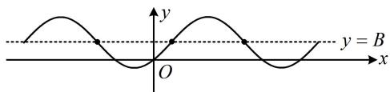

> [!faq]- 《第4节 整体换元法的应用》参考答案
>
> > [!success]- **【答案】** A
>
> > [!note]- **【分析】**
> > 本题未单列分析。
>
> > [!note]- **【解析】**
> > ## 14. (2022·新课标Ⅰ卷·★★★)
> >
> > 记函数 $f(x) = \sin \left( \omega x + \frac{\pi}{4} \right) + b(\omega > 0)$ 的最小正周期为 $T$ ，若 $\frac{2\pi}{3} < T < \pi$ ，且 $y = f(x)$ 的图象关于点 $\left( \frac{3\pi}{2}, 2 \right)$ 中心对称，则 $f\left( \frac{\pi}{2} \right) = (\quad)$ A. 1 B. $\frac{3}{2}$ C. $\frac{5}{2}$ D. 3
> >
> > 解析：要求 $f\left(\frac{\pi}{2}\right)$ ，应先求 $\omega$ 和 $b$ ，题干给出了 $T$ 的范围，可由此找到 $\omega$ 的范围，
> >
> > 因为 $\frac{2\pi}{3} < T < \pi$ ，所以 $\frac{2\pi}{3} < \frac{2\pi}{\omega} < \pi$ ，故 $2 < \omega < 3$
> >
> > 函数 $y = A \sin(\omega x + \varphi) + B$ 的对称中心纵坐标是 B，故由题设所给的对称中心可直接得到 b，
> >
> > 函数 $y = f(x)$ 的图象关于点 $\left(\frac{3\pi}{2}, 2\right)$ 中心对称 $\Rightarrow b = 2$ ，
> >
> > 且 $\omega \cdot \frac{3\pi}{2} +\frac{\pi}{4} = k\pi$ ，所以 $\omega = \frac{2}{3} k - \frac{1}{6} (k\in \mathbf{Z})$ ，结合
> >
> > $2 < \omega < 3$ 可得 $k = 4$ ， $\omega = \frac{5}{2}$ ，故 $f(x) = \sin \left(\frac{5}{2} x + \frac{\pi}{4}\right) + 2$
> >
> > 所以 $f\left(\frac{\pi}{2}\right) = \sin \left(\frac{5}{2} \times \frac{\pi}{2} + \frac{\pi}{4}\right) + 2 = \sin \frac{3\pi}{2} + 2 = 1$
>
> > [!tip]- **【反思】**
> > 如图，函数 $y = A\sin (\omega x + \varphi) + B$ 的对称中心就是图象上能使 $\sin (\omega x + \varphi) = 0$ 的那些点，其横坐标可由 $\omega x + \varphi = k\pi (k \in \mathbf{Z})$ 来求，纵坐标即为 $B$ .
> >
> > 
