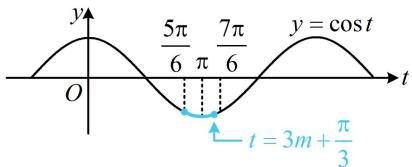

> [!faq]- 《第4节 整体换元法的应用》参考答案
>
> > [!success]- **【答案】** D
>
> > [!note]- **【分析】**
> > 本题未单列分析。
>
> > [!note]- **【解析】**
> > D
> > 解析： $T=\frac{2\pi}{3}\Rightarrow\omega=\frac{2\pi}{T}=3$ ，所以 $f(x)=\cos(3x+\varphi)$ 又 $f(x)$ 关于 $\left(\frac{\pi}{18},0\right)$ 对称，所以 $3\times\frac{\pi}{18}+\varphi=k\pi+\frac{\pi}{2}$ 故 $\varphi = k\pi + \frac{\pi}{3} (k \in \mathbf{Z})$ ，结合 $0 < \varphi < \pi$ 可得 $\varphi = \frac{\pi}{3}$ 所以 $f(x)=\cos\left(3x+\frac{\pi}{3}\right)$ ，要分析 $f(x)$ 在 $\left[\frac{\pi}{6},m\right]$ 上的值域，可将 $3x+\frac{\pi}{3}$ 换元成 t，借助 y=cos t 的图象来研究，
> > 设 $t=3x+\frac{\pi}{3}$ ，则 $f(x)=\cos t$ ，且当 $x\in\left[\frac{\pi}{6},m\right]$ 时， $t\in\left[\frac{5\pi}{6},3m+\frac{\pi}{3}\right]$ ，函数 $y=\cos t$ 的大致图象如图，
> > 注意到 $\cos\frac{5\pi}{6}=\cos\frac{7\pi}{6}=-\frac{\sqrt{3}}{2}$ 所以要使 $y = \cos t$ 在 $\left[\frac{5\pi}{6}, 3m + \frac{\pi}{3}\right]$ 上的值域为 $\left[-1, -\frac{\sqrt{3}}{2}\right]$ ，
> > 应有右端点 $3m + \frac{\pi}{3}$ 只能在 $\pi$ 和 $\frac{7\pi}{6}$ 之间，
> > 即 $\pi \leq 3m + \frac{\pi}{3} \leq \frac{7\pi}{6}$ ，解得： $\frac{2\pi}{9} \leq m \leq \frac{5\pi}{18}$ .
> >
> > 
