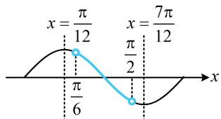

> [!faq]- 《第4节 整体换元法的应用》参考答案
>
> > [!success]- **【答案】** 详见解析
>
> > [!note]- **【分析】**
> > 本题未单列分析。
>
> > [!note]- **【解析】**
> > ## 17. 解：（1）（由函数值相等条件联想到它们的中间可能为对
> >
> > 称轴，故先看看它们是否在一个周期内）
> >
> > 因为 $f(x)$ 在 $\left(\frac{\pi}{6},\frac{\pi}{2}\right)$ 上单调，所以 $\frac{\pi}{2} -\frac{\pi}{6}\leq \frac{T}{2}$ ，故 $T\geq \frac{2\pi}{3}$
> >
> > (这就说明 $\frac{\pi}{2}$ 和 $\frac{2\pi}{3}$ 在一个周期内)
> >
> > 又 $f\left(\frac{\pi}{2}\right) = f\left(\frac{2\pi}{3}\right)$ ，所以 $x = \frac{1}{2} \times \left(\frac{\pi}{2} + \frac{2\pi}{3}\right) = \frac{7\pi}{12}$ 为 $y = f(x)$ 图象的一条对称轴.
> >
> > （2）由（1）知 $T \geq \frac{2\pi}{3}$ ，所以 $\omega = \frac{2\pi}{T} \leq 3$ ，结合 $\omega \in \mathbf{N}^*$ 知 $\omega$ 只可能取 1，2，3，（ $\omega$ 的值已可通过讨论确定，求 $\varphi$ 只需再来一个方程，现在有两个构造方程的方向：（1）中的对称轴结论、（2）中的 $f\left(\frac{\pi}{6}\right) = \frac{\sqrt{3}}{2}$ ，用哪个呢？都行，但前者得到的方程更简单，故由前者求 $\varphi$ ，再用后者来验证此时的 $\omega$ 与 $\varphi$ 是否可取）
> >
> > 因为 $x = \frac{7\pi}{12}$ 是 $y = f(x)$ 图象的一条对称轴，
> >
> > 所以 $\omega \cdot \frac{7\pi}{12} +\varphi = \frac{\pi}{2} +k\pi (k\in \mathbf{Z})$ ①，
> >
> > 若 $\omega = 1$ ，则由①得 $\varphi = k\pi -\frac{\pi}{12}$ ，结合 $\left|\varphi \right| <   \frac{\pi}{2}$ 得 $\varphi = -\frac{\pi}{12}$
> >
> > 所以 $f(x) = \sin \left(x - \frac{\pi}{12}\right), f\left(\frac{\pi}{6}\right) = \sin \frac{\pi}{12} \neq \frac{\sqrt{3}}{2}$ ，不合题意；
> >
> > 若 $\omega = 2$ ，则由①可得 $\varphi = k\pi -\frac{2\pi}{3}$ ，结合 $|\varphi | <   \frac{\pi}{2}$ 得 $\varphi = \frac{\pi}{3}$
> >
> > 所以 $f(x) = \sin \left(2x + \frac{\pi}{3}\right),\quad f\left(\frac{\pi}{6}\right) = \sin \frac{2\pi}{3} = \frac{\sqrt{3}}{2},$
> >
> > （由对称轴 $x = \frac{7\pi}{12}$ 求出的 $\varphi$ 不一定满足 $f(x)$ 在 $\left(\frac{\pi}{6},\frac{\pi}{2}\right)$ 上单调，故需检验，可结合周期找 $x = \frac{7\pi}{12}$ 左侧的对称轴来看）
> >
> > $$
> > T = \pi
> > $$
> >
> > $$
> > x = \frac {7 \pi}{1 2}
> > $$
> >
> > $$
> > x =
> > $$
> >
> > $\frac{7\pi}{12} - \frac{\pi}{2} = \frac{\pi}{12}$ ，故 $f(x)$ 在 $\left(\frac{\pi}{12}, \frac{7\pi}{12}\right)$ 上单调，
> >
> > 如图，因为 $\left(\frac{\pi}{6},\frac{\pi}{2}\right)\subseteq \left(\frac{\pi}{12},\frac{7\pi}{12}\right)$ ，所以 $f(x)$ 在 $\left(\frac{\pi}{6},\frac{\pi}{2}\right)$
> >
> > 调，满足题意；
> >
> > 若 $\omega = 3$ ，则由①得 $\varphi = k\pi -\frac{5\pi}{4}$ ，结合 $|\varphi | <   \frac{\pi}{2}$ 得 $\varphi = -\frac{\pi}{4}$
> >
> > 所以 $f(x) = \sin \left(3x - \frac{\pi}{4}\right), f\left(\frac{\pi}{6}\right) = \sin \frac{\pi}{4} \neq \frac{\sqrt{3}}{2}$ ，不合题意；
> >
> > 综上所述， $\varphi$ 的值为 $\frac{\pi}{3}$ .
> >
> > 
>
> > [!tip]- **【反思】**
> > 本题的核心也是翻译每一个条件，例如在某区间单调、对称轴、特定点的函数值等，这些条件可以翻译成关于 $\omega$ 或 $\varphi$ 的方程或不等式。回顾本节练习可发现，诸多三角函数图象性质的考题，都是通过翻译条件得到思路。
> >
> > 一数·必刷100讲
