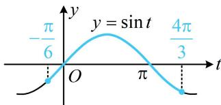

> [!faq]- 《第4节 整体换元法的应用》例题解析
>
> > [!success]- **【答案】** $-\sqrt{3}$
>
> > [!note]- **【分析】**
> > 本题未单列分析。
>
> > [!note]- **【解析】**
> > 解析：由题意， $f(x) = \sin \left(\frac{\pi}{2} -x\right)\sin x - \sqrt{3}\cos^2 x = \cos x\sin x - \sqrt{3}\cos^2 x = \frac{1}{2}\sin 2x - \sqrt{3}\cdot \frac{1 + \cos 2x}{2}$ $= \frac{1}{2}\sin 2x - \frac{\sqrt{3}}{2}\cos 2x - \frac{\sqrt{3}}{2} = \sin \left(2x - \frac{\pi}{3}\right) - \frac{\sqrt{3}}{2},$
> >
> > 要求 $f(x)$ 的最小值，直接对 $f(x)$ 作图较麻烦，可将 $2x - \frac{\pi}{3}$ 换元成 $t$ ，用 $y = \sin t$ 的图象来分析，
> >
> > 令 $t = 2x - \frac{\pi}{3}$ ，则 $f(x) = \sin t - \frac{\sqrt{3}}{2}$ ，因为 $\frac{\pi}{12} \leq x \leq \frac{5\pi}{6}$ ，所以 $-\frac{\pi}{6} \leq t \leq \frac{4\pi}{3}$
> >
> > 当 $\sin t$ 最小时， $f(x)$ 也最小，故要求 $f(x)$ 的最小值，可先求 $y = \sin t$ 在 $\left[-\frac{\pi}{6}, \frac{4\pi}{3}\right]$ 上的最小值，
> >
> > 函数 $y = \sin t$ 的部分图象如图所示，由图可知，
> >
> > $$
> > f (x) _ {\min} = \sin \frac {4 \pi}{3} - \frac {\sqrt {3}}{2} = - \sin \frac {\pi}{3} - \frac {\sqrt {3}}{2} = - \sqrt {3}.
> > $$
> >
> >
> > 
