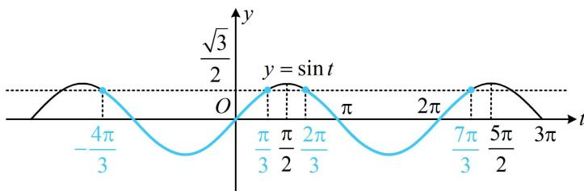

> [!faq]- 《第4节 整体换元法的应用》例题解析
>
> > [!success]- **【答案】** 详见解析
>
> > [!note]- **【分析】**
> > 本题未单列分析。
>
> > [!note]- **【解析】**
> > 解析：由题意， $f(x) = 2\sqrt{3}\left(\sin 2x\cos \frac{\pi}{3} +\cos 2x\sin \frac{\pi}{3}\right) + \sqrt{3}\sin 2x - \cos 2x = 2\sqrt{3}\sin 2x + 2\cos 2x = 4\sin \left(2x + \frac{\pi}{6}\right),$ 所以 $f(x)\leq 2\sqrt{3}$ 即为 $4\sin \left(2x + \frac{\pi}{6}\right)\leq 2\sqrt{3}$ ，也即 $\sin \left(2x + \frac{\pi}{6}\right)\leq \frac{\sqrt{3}}{2},$
> >
> > 三角不等式常画图来解，画 $y = \sin \left(2x + \frac{\pi}{6}\right)$ 的图象较麻烦，故将 $2x + \frac{\pi}{6}$ 换元成 $t$ ，用 $y = \sin t$ 的图象来解，令 $t = 2x + \frac{\pi}{6}$ ，则 $\sin t \leq \frac{\sqrt{3}}{2}$ ，函数 $y = \sin t$ 的部分图象如图，
> >
> > 由图可知不等式 $\sin t \leq \frac{\sqrt{3}}{2}$ 的解也呈现出周期特征，可先取一个周期内的解，再加上周期的整数倍，
> >
> > 在 $\left[\frac{\pi}{2},\frac{5\pi}{2}\right)$ 这个周期上， $\sin t \leq \frac{\sqrt{3}}{2}$ 的解集为 $\left[\frac{2\pi}{3},\frac{7\pi}{3}\right]$ ，所以 $\sin t \leq \frac{\sqrt{3}}{2}$ 的完整解集为 $\left[2k\pi + \frac{2\pi}{3}, 2k\pi + \frac{7\pi}{3}\right]$ ，上面得到的是 $t$ 的范围，将 $t$ 换回 $2x + \frac{\pi}{6}$ ，即可求解 $x$ 的范围，
> >
> > 由 $2k\pi + \frac{2\pi}{3} \leq 2x + \frac{\pi}{6} \leq 2k\pi + \frac{7\pi}{3}$ 得 $k\pi + \frac{\pi}{4} \leq x \leq k\pi + \frac{13\pi}{12}$ ，故原不等式的解集为 $\left[k\pi + \frac{\pi}{4}, k\pi + \frac{13\pi}{12}\right](k \in \mathbf{Z})$ 。答案： $\left[k\pi + \frac{\pi}{4}, k\pi + \frac{13\pi}{12}\right](k \in \mathbf{Z})$
> >
> > 
>
> > [!tip]- **【总结】**
> > 解有关 $y = A\sin (\omega x + \varphi) + B$ 的函数值问题，可令 $t = \omega x + \varphi$ ，用 $y = \sin t$ 的图象来分析更简单.
