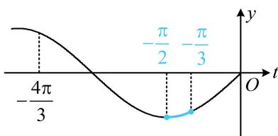
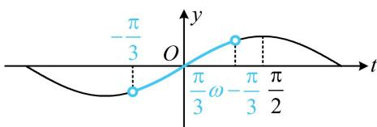

> [!faq]- 《第4节 整体换元法的应用》例题解析
>
> > [!success]- **【答案】** $\left[-\frac{\pi}{12},0\right]$
>
> > [!note]- **【分析】**
> > 本题未单列分析。
>
> > [!note]- **【解析】**
> > 解析：设 $t = 2x - \frac{\pi}{3}$ ，则 $f(x) = \sin t$ ，当 $x\in \left[-\frac{\pi}{2},0\right]$ 时， $t\in \left[-\frac{4\pi}{3}, - \frac{\pi}{3}\right],$
> >
> > 要求 $f(x)$ 的增区间，只需寻找函数 $y = \sin t$ 在 $\left[-\frac{4\pi}{3}, -\frac{\pi}{3}\right]$ 上的增区间，
> >
> > 如图，由图可知，函数 $y = \sin t$ 在 $\left[-\frac{4\pi}{3}, -\frac{\pi}{2}\right]$ 上 $\searrow$ ，在 $\left[-\frac{\pi}{2}, -\frac{\pi}{3}\right]$ 上 $\nearrow$
> >
> > 所以令 $-\frac{\pi}{2} \leq 2x - \frac{\pi}{3} \leq -\frac{\pi}{3}$ 可得： $-\frac{\pi}{12} \leq x \leq 0$
> >
> > 
> >
> > 故 $f(x)$ 在 $\left[-\frac{\pi}{2},0\right]$ 上的单调递增区间是 $\left[-\frac{\pi}{12},0\right]$ .
> >
> >
> > $$
> > f (x) = \sin \left(\omega x - \frac {\pi}{3}\right) (\omega > 0)
> > $$
> >
> > $$
> > \left(0, \frac {\pi}{3}\right)
> > $$
> >
> > $$
> > t = \omega x - \frac {\pi}{3}
> > $$
> >
> > $$
> > f (x) = \sin t
> > $$
> >
> > $$
> > y = \sin t
> > $$
> >
> > $$
> > \omega x - \frac {\pi}{3}
> > $$
> >
> > $$
> > x \in \left(0, \frac {\pi}{3}\right)
> > $$
> >
> > $$
> > t \in \left(- \frac {\pi}{3}, \frac {\pi}{3} \omega - \frac {\pi}{3}\right)
> > $$
> >
> > 所以 $f(x)$ 在 $\left(0, \frac{\pi}{3}\right)$ 上是单调函数等价于 $y = \sin t$ 在 $\left(-\frac{\pi}{3}, \frac{\pi}{3} \omega - \frac{\pi}{3}\right)$ 上是单调函数，
> >
> > 如图，由图可知应有 $\frac{\pi}{3}\omega -\frac{\pi}{3}\leq \frac{\pi}{2}$ ，结合 $\omega >0$ 可得 $0 <   \omega \leq \frac{5}{2}$
> >
> > 答案： $\left(0,\frac{5}{2}\right]$
> >
> > 
