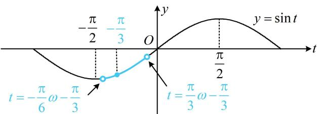

> [!faq]- 《第4节 整体换元法的应用》例题解析
>
> > [!success]- **【答案】** (0,1]
>
> > [!note]- **【分析】**
> > 本题未单列分析。
>
> > [!note]- **【解析】**
> > 解法1：为了简化问题，可先将 $\omega x - \frac{\pi}{3}$ 换元成 $t$ ，转化为 $y = \sin t$ 来研究单调性，
> >
> > 设 $t = \omega x - \frac{\pi}{3}$ ，则 $f(x) = \sin t$ ，当 $x\in \left(-\frac{\pi}{6},\frac{\pi}{3}\right)$ 时， $t\in \left(-\frac{\pi}{6}\omega -\frac{\pi}{3},\frac{\pi}{3}\omega -\frac{\pi}{3}\right),$
> >
> > 所以 $f(x)$ 在 $\left(-\frac{\pi}{6},\frac{\pi}{3}\right)$ 上 $\nearrow$ 等价于 $y = \sin t$ 在 $\left(-\frac{\pi}{6}\omega -\frac{\pi}{3},\frac{\pi}{3}\omega -\frac{\pi}{3}\right)$ 上 $\nearrow$ 此区间左右端点都在变，怎么办呢？注意到 $-\frac{\pi}{3}$ 在该区间内，要保证单调，该区间只能包含于 $\left[-\frac{\pi}{2}, \frac{\pi}{2}\right]$ ，所以 $\left\{ \begin{array}{l} -\frac{\pi}{6} \omega - \frac{\pi}{3} \geq -\frac{\pi}{2} \\ \frac{\pi}{3} \omega - \frac{\pi}{3} \leq \frac{\pi}{2} \end{array} \right.$ ，结合 $\omega > 0$ 可得 $0 < \omega \leq 1$ 。解法2：我们也可先求出 $f(x)$ 全部的 $\nearrow$ 区间，根据 $\left(-\frac{\pi}{6}, \frac{\pi}{3}\right)$ 包含于该 $\nearrow$ 区间，求得 $\omega$ 的范围， $2k\pi - \frac{\pi}{2} \leq \omega x - \frac{\pi}{3} \leq 2k\pi + \frac{\pi}{2} \Rightarrow \frac{1}{\omega} \left( 2k\pi - \frac{\pi}{6} \right) \leq x \leq \frac{1}{\omega} \left( 2k\pi + \frac{5\pi}{6} \right)$ ，所以 $f(x)$ 的增区间是 $\left[ \frac{1}{\omega} \left( 2k\pi - \frac{\pi}{6} \right), \frac{1}{\omega} \left( 2k\pi + \frac{5\pi}{6} \right) \right]$ ，其中 $k \in \mathbf{Z}$ ，因为 $f(x)$ 在 $\left(-\frac{\pi}{6}, \frac{\pi}{3}\right)$ 上 $\nearrow$ ，所以 $\left(-\frac{\pi}{6}, \frac{\pi}{3}\right) \subseteq \left[ \frac{1}{\omega} \left( 2k\pi - \frac{\pi}{6} \right), \frac{1}{\omega} \left( 2k\pi + \frac{5\pi}{6} \right) \right]$ ，注意到 $\left(-\frac{\pi}{6}, \frac{\pi}{3}\right)$ 这个区间含0，那么它必定包含于 $\left[ \frac{1}{\omega} \left( 2k\pi - \frac{\pi}{6} \right), \frac{1}{\omega} \left( 2k\pi + \frac{5\pi}{6} \right) \right]$ 含0的那段，即 $k = 0$ 那段，当 $k = 0$ 时， $\left[ \frac{1}{\omega} \left( 2k\pi - \frac{\pi}{6} \right), \frac{1}{\omega} \left( 2k\pi + \frac{5\pi}{6} \right) \right]$ 即为 $\left[-\frac{\pi}{6\omega}, \frac{5\pi}{6\omega}\right]$ ，所以 $\left(-\frac{\pi}{6}, \frac{\pi}{3}\right) \subseteq \left[-\frac{\pi}{6\omega}, \frac{5\pi}{6\omega}\right]$ ，从而 $\left\{ \begin{array}{l} -\frac{\pi}{6} \geq -\frac{\pi}{6\omega} \\ \frac{\pi}{3} \leq \frac{5\pi}{6\omega} \end{array} \right.$ ，故 $0 < \omega \leq 1$ 。
> >
> > 
>
> > [!tip]- **【反思】**
> > 解法 2 虽计算量稍大, 但更具一般性. 若 $t$ 的取值区间没有定值 $-\frac{\pi}{3}$ , 则只能用解法 2.
