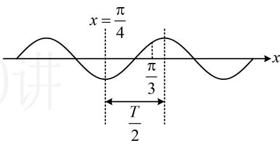

> [!faq]- 《第4节 整体换元法的应用》例题解析
>
> > [!success]- **【答案】** B
>
> > [!note]- **【分析】**
> > 本题未单列分析。
>
> > [!note]- **【解析】**
> > $$
> > \omega
> > $$
> >
> > $x = -\frac{\pi}{4}$ 是 $f(x)$ 的零点 $\Rightarrow -\frac{\pi}{4}\omega + \varphi = k_1\pi (k_1 \in \mathbf{Z})$ ， $x = \frac{\pi}{4}$ 是 $f(x)$ 图象的对称轴 $\Rightarrow \frac{\pi}{4}\omega + \varphi = k_2\pi + \frac{\pi}{2} (k_2 \in \mathbf{Z})$ ，我们要求 $\omega$ 的最大值，应消去 $\varphi$ ，两式作差得： $-\frac{\pi}{4}\omega - \frac{\pi}{4}\omega = (k_1 - k_2)\pi - \frac{\pi}{2}$ ，整理得： $\omega = 2(k_2 - k_1) + 1$ ，注意到 $k_1$ 、 $k_2$ 均为任意整数，所以 $k_2 - k_1$ 也为任意整数，记 $k = k_2 - k_1$ ，则 $\omega = 2k + 1 (k \in \mathbf{Z})$ ，接下来可由 $f(x)$ 在 $\left(\frac{\pi}{4}, \frac{\pi}{3}\right)$ 上单调，来约束 $\omega$ 的范围，如图，注意到 $x = \frac{\pi}{4}$ 处是最值点，所以 $f(x)$ 在区间 $\left(\frac{\pi}{4}, \frac{\pi}{3}\right)$ 上单调的充要条件是区间宽度不超过半个周期 $\frac{T}{2}$ ，所以 $\frac{\pi}{3} - \frac{\pi}{4} \leq \frac{T}{2}$ ，从而 $T \geq \frac{\pi}{6}$ ，故 $\frac{2\pi}{\omega} \geq \frac{\pi}{6}$ ，解得： $\omega \leq 12$ ，结合 $\omega = 2k + 1 (k \in \mathbf{Z})$ 可得 $\omega_{\max} = 11$ 。
> >
> >
> > 
>
> > [!tip]- **【反思】**
> > 当题目直接给出某些点的坐标时（例如对称轴、对称中心或其它点），可考虑用代数形式翻译这些条件，找到 $\omega$ 的通
> > 解（例如上面的 $\omega = 2(k_{2} - k_{1}) + 1$ ），再来确定整数 $k_{1}$ ， $k_{2}$ 的取值.
