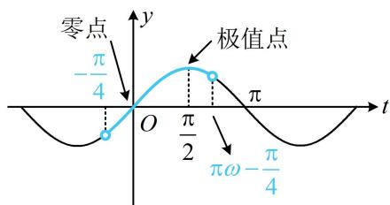

> [!faq]- 《第4节 整体换元法的应用》例题解析
>
> > [!success]- **【答案】** $\left(\frac{3}{4},\frac{5}{4}\right]$
>
> > [!note]- **【分析】**
> > 本题未单列分析。
>
> > [!note]- **【解析】**
> > 解析：为了便于分析，先将 $\omega x - \frac{\pi}{4}$ 换元成 $t$ ，利用 $y = \sin t$ 的图象来研究零点和极值点，
> >
> > 设 $t = \omega x - \frac{\pi}{4}$ ，则 $f(x) = \sin t$ ，当 $x\in (0,\pi)$ 时， $t\in \left(-\frac{\pi}{4},\pi \omega -\frac{\pi}{4}\right),$
> >
> > 故问题等价于 $y = \sin t$ 在 $\left(-\frac{\pi}{4}, \pi \omega - \frac{\pi}{4}\right)$ 上有 1 个零点和 1 个极值点，如图，由图可知应有 $\frac{\pi}{2} < \pi \omega - \frac{\pi}{4} \leq \pi$ ，解得： $\frac{3}{4} < \omega \leq \frac{5}{4}$ .
> >
> > 
