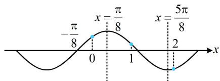

> [!faq]- 《第1节 三角函数图象性质综合问题》参考答案
>
> > [!success]- **【答案】** B
>
> > [!note]- **【分析】**
> > 本题未单列分析。
>
> > [!note]- **【解析】**
> > B
> >
> > 解析： $f(x)$ 的最小正周期 $T = \pi \Rightarrow \omega = \frac{2\pi}{T} = 2$
> >
> > 又 $f(x)$ 关于 $\left(-\frac{\pi}{8},0\right)$ 对称，
> >
> > 所以 $f\left(-\frac{\pi}{8}\right) = \sin \left[2\times \left(-\frac{\pi}{8}\right) + \varphi \right] = 0$ ，故 $\sin \left(\varphi -\frac{\pi}{4}\right) = 0$
> >
> > 结合 $0 < \varphi < \frac{\pi}{2}$ 可得 $\varphi = \frac{\pi}{4}$ ，所以 $f(x) = \sin \left(2x + \frac{\pi}{4}\right)$ ，
> >
> > 要比较 $f(0)$ ， $f(1)$ ， $f(2)$ ，可作出 $f(x)$ 的草图，将它们在图中标出来看。 $-\frac{\pi}{8}$ 是零点，结合周期为 $\pi$ 可得 $x = \frac{\pi}{8}$ 必为最值点， $f\left(\frac{\pi}{8}\right) = \sin \left(2 \times \frac{\pi}{8} + \frac{\pi}{4}\right) = 1 \Rightarrow x = \frac{\pi}{8}$ 是最大值点，
> >
> > 如图， $f(2) < 0$ ， $f(0) > 0$ ， $f(1) > 0$ ，所以 $f(2)$ 最小，
> >
> > 再比较 $f(0)$ 和 $f(1)$ ，只需看0和1离对称轴 $x = \frac{\pi}{8}$ 的距离，距离越小，函数值越大，
> >
> > 又 $\frac{\pi}{8} - 0 < 1 - \frac{\pi}{8}$ ，所以 $f(0) > f(1)$ ，故 $f(2) < f(1) < f(0)$ .
> >
> > 
