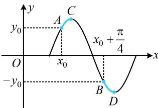

> [!faq]- 《第1节 三角函数图象性质综合问题》参考答案
>
> > [!success]- **【答案】** B
>
> > [!note]- **【分析】**
> > 本题未单列分析。
>
> > [!note]- **【解析】**
> > B
> >
> > 解析：图中没有任何零点、最值点这些关键点，如何求周期？注意到图上给出函数值相反的两个点，故分析这两点之间的距离与周期的关系，
> >
> > 如图，由对称性，两段蓝色的曲线是相同的（将任何一段沿 $x$ 轴翻折，就和另一段相同了），所以从点 $A$ 到点 $B$ 的横向距离，
> >
> > 与从点 C 到点 D 的横向距离相等，都等于 $\frac{T}{2}$ ，故 $\frac{T}{2} = \left(x_{0} + \frac{\pi}{4}\right) - x_{0} = \frac{\pi}{4} \Rightarrow T = \frac{\pi}{2} \Rightarrow \omega = \frac{2\pi}{T} = 4$ .
> >
> > 
