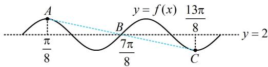

> [!faq]- 《第1节 三角函数图象性质综合问题》参考答案
>
> > [!success]- **【答案】** D
>
> > [!note]- **【分析】**
> > 本题未单列分析。
>
> > [!note]- **【解析】**
> > 解析：逐个代入计算较麻烦，但可发现 $\frac{\pi}{8}$ 和 $\frac{13\pi}{8}$ ， $\frac{2\pi}{8}$ 和 $\frac{12\pi}{8}$ ，…， $\frac{6\pi}{8}$ 和 $\frac{8\pi}{8}$ 两两关于 $\frac{7\pi}{8}$ 对称，故猜想 $\frac{7\pi}{8}$ 可能与 $f(x)$ 的对称性有关，下面先验证这一猜想，因为 $f\left(\frac{7\pi}{8}\right)=\sqrt{2}\sin\left(2\times\frac{7\pi}{8}+\frac{\pi}{4}\right)+2=\sqrt{2}\sin 2\pi+2=2$ ，所以 $f(x)$ 的图象关于点 $B\left(\frac{7\pi}{8},2\right)$ 对称，
> >
> > 既然 B 是对称中心，那么其它点必定也两两关于该点对称，既然 B 是对称中心，那么其它点必定也两两关于该点对称，
> > 如图， $A\left(\frac{\pi}{8},f\left(\frac{\pi}{8}\right)\right)$ 和 $C\left(\frac{13\pi}{8},f\left(\frac{13\pi}{8}\right)\right)$ 关于 B 对称，
> > 故 $\frac{f\left(\frac{\pi}{8}\right)+f\left(\frac{13\pi}{8}\right)}{2}=f\left(\frac{7\pi}{8}\right)\Rightarrow f\left(\frac{\pi}{8}\right)+f\left(\frac{13\pi}{8}\right)=2f\left(\frac{7\pi}{8}\right)=4$ 同理， $f\left(\frac{2\pi}{8}\right)+f\left(\frac{12\pi}{8}\right)=f\left(\frac{3\pi}{8}\right)+f\left(\frac{11\pi}{8}\right)=\cdots$ $=f\left(\frac{6\pi}{8}\right)+f\left(\frac{8\pi}{8}\right)=4$ 所以 $f\left(\frac{\pi}{8}\right)+f\left(\frac{2\pi}{8}\right)+\cdots+f\left(\frac{13\pi}{8}\right)=4\times6+2=26.$
> >
> > 
