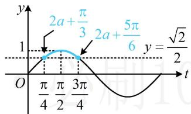

> [!faq]- 《第1节 三角函数图象性质综合问题》参考答案
>
> > [!success]- **【答案】** D
>
> > [!note]- **【分析】**
> > 本题未单列分析。
>
> > [!note]- **【解析】**
> > 解析：要研究 $f(x)$ 的区间最值，可将 $2x + \frac{\pi}{3}$ 换元成 t，转化为研究 $y = \sin t$ 的区间最值，
> > 令 $t = 2x + \frac{\pi}{3}$ ，则 $f(x) = \sin t$ 当 $x \in \left[a, a + \frac{\pi}{4}\right]$ 时， $t \in \left[2a + \frac{\pi}{3}, 2a + \frac{5\pi}{6}\right]$ ,
> > 下面画图分析，区间 $\left[2a+\frac{\pi}{3},2a+\frac{5\pi}{6}\right]$ 的位置会随a的变化而改变，但其宽度保持 $\frac{\pi}{2}$ 不变，始终为 $y=\sin t$ 的四分之一个周期，
> > 可结合图象想象运动过程，
> > 如图所示的情形即为 $g_{1}(a)-g_{2}(a)$ 最小的情形，
> > 由图可知 $g_{1}(a)-g_{2}(a)$ 的最小值为 $1-\frac{\sqrt{2}}{2}$ .
> >
> > 
