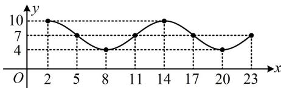
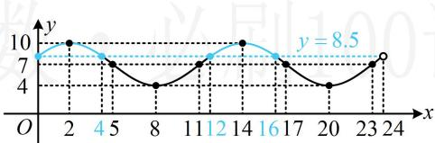
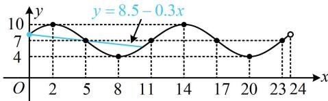

> [!faq]- 《第1节 三角函数图象性质综合问题》参考答案
>
> > [!success]- **【答案】** ABD
>
> > [!note]- **【分析】**
> > 本题未单列分析。
>
> > [!note]- **【解析】**
> > 解析：A项，为了便于求 $A$ ， $\omega$ ， $\varphi$ ， $h$ ，我们先把所给表格中的数据画成图象，再作观察，
> >
> > 如图1，函数在 $x = 8$ 处取得最小值4，在 $x = 14$ 处取得最大值10，所以 $\frac{T}{2} = 14 - 8 = 6 \Rightarrow T = 12 \Rightarrow \omega = \frac{2\pi}{T} = \frac{\pi}{6}$ ，
> >
> >   
> > 图1
> >
> > 又 $\left\{ \begin{array}{l} y_{\max} = A + h = 10 \\ y_{\min} = -A + h = 4 \end{array} \right.$ ，所以 $A = 3$ ， $h = 7$ 故 $y = 3\sin \left(\frac{\pi}{6} x + \varphi\right) + 7$
> >
> > 因为函数 $y = 3\sin \left(\frac{\pi}{6} x + \varphi\right) + 7$ 的图象过点(2,10)，所以 $3\sin \left(\frac{\pi}{6} \times 2 + \varphi\right) + 7 = 10$ ，故 $\sin \left(\frac{\pi}{3} + \varphi\right) = 1$ ①，又 $-\frac{\pi}{2} < \varphi < \frac{\pi}{2}$ ，所以 $-\frac{\pi}{6} < \frac{\pi}{3} + \varphi < \frac{5\pi}{6}$ ，结合①可得 $\frac{\pi}{3} + \varphi = \frac{\pi}{2}$ ，故 $\varphi = \frac{\pi}{6}$ ，所以函数表达式为 $y = 3\sin \left(\frac{\pi}{6} x + \frac{\pi}{6}\right) + 7$ ， $x \in [0,24)$ ，
> >
> > 故A项正确；
> >
> > B项，满载货物时，船的吃水深度为6米，所以用水深 $y$ 减去吃水深度6，即为船底到水底的距离，该距离应不小于2.5米，由此即可建立不等式求 $x$ 的范围，由题意， $y - 6 \geq 2.5$ ，所以 $y \geq 8.5$ ，故 $3\sin \left(\frac{\pi}{6} x + \frac{\pi}{6}\right) + 7 \geq 8.5$ ，其中 $0 \leq x < 24$ ，解三角不等式，考虑画图，这里由于已有 $y = 3\sin \left(\frac{\pi}{6} x + \frac{\pi}{6}\right) + 7$ 的部分图象，故考虑直接用它来分析，函数 $y = 3\sin \left(\frac{\pi}{6} x + \frac{\pi}{6}\right) + 7$ 在[0,24)上的图象如图2，注意到当 $x = 0,4,12,16,24$ 时， $y = 8.5$ ，所以结合图2可知 $3\sin \left(\frac{\pi}{6} x + \frac{\pi}{6}\right) + 7 \geq 8.5 \Leftrightarrow 0 \leq x \leq 4$ 或 $12 \leq x \leq 16$ 故B项正确；
> >
> >   
> > 图2
> >
> > C项，当 $x = 19$ 时，水深 $y = 3\sin \left(\frac{\pi}{6}\times 19 + \frac{\pi}{6}\right) + 7$
> >
> > $$
> > = - \frac {3 \sqrt {3}}{2} + 7
> > $$
> >
> > 所以此时船底离水底的距离为 $-\frac{3\sqrt{3}}{2} + 7 - 3 = 4 - \frac{3\sqrt{3}}{2} < 2.5$ ，所以该船卸完货物后，不能在19时离港，故C项错误；
> >
> > D 项, 要最早完成卸货, 那就从 0 点开始进港卸货, 水深在变, 船的吃水深度也会变, 应综合考虑二者. 若卸货中途不满足港口的停靠条件, 则需暂时离港, 这种情况会发生吗? 会, 比如看上午 8 点时, 此时卸货未完成, 船吃水深度大于 3 米, 但水深只有 4 米, 所以船底离水底小于 1 米, 这个时刻是不允许船停在港口的, 于是我们需要先分析船暂时离港的时刻,
> >
> > $$
> > y = 6 - 0. 3 x, \quad 0 \leq x \leq 1 0
> > $$
> >
> > 所以时刻 $x$ ，船底离水底的深度为
> >
> > $$
> > d = 3 \sin \left(\frac {\pi}{6} x + \frac {\pi}{6}\right) + 7 - (6 - 0. 3 x)
> > $$
> >
> > 令 $d \geq 2.5$ 得 $3\sin \left(\frac{\pi}{6} x + \frac{\pi}{6}\right) + 7 - (6 - 0.3x) \geq 2.5$
> >
> > 所以 $3\sin \left(\frac{\pi}{6} x + \frac{\pi}{6}\right) + 7 \geq 8.5 - 0.3x$ ②，
> >
> > 不等式②不易严格求解，但这里我们也无需完全解出不等式②，只需找到首次不满足②的位置，可考虑直接画图看，如图3，经尝试， $y = 3\sin \left(\frac{\pi}{6} x + \frac{\pi}{6}\right) + 7$ 和 $y = 8.5 - 0.3x$ 都过点(5,7)，所以卸货5小时后，在5点该船必须暂时驶离港口，此时该船的吃水深度为4.5米，下次何时返回继续卸货？ $4.5 + 2.5 = 7$ ，所以需要水深再次达到7米才能返回，
> >
> > 由图3可知下次水深为7米的时刻是11点，故该船在11点可返回港口继续卸货，5小时后完成卸货（期间水深一直不低于7米，不会再次触发离港条件），此时为16点，
> >
> > 综上所述，该船在0点进港开始卸货，5点暂时驶离港口，11点返回港口继续卸货，16点完成卸货任务，故D项正确.
> >
> >   
> > 图3
