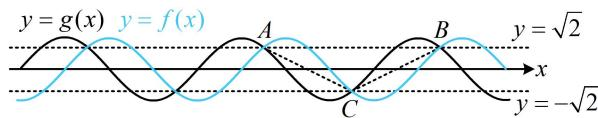

> [!faq]- 《第1节 三角函数图象性质综合问题》参考答案
>
> > [!success]- **【答案】** $\sqrt{2}\pi$
>
> > [!note]- **【分析】**
> > 本题未单列分析。
>
> > [!note]- **【解析】**
> > 解析：设 $f(x)$ 的最小正周期为 $T$ ，由题意，
> >
> > $\frac{T}{2} = \frac{2\pi}{3} -\frac{\pi}{6} = \frac{\pi}{2}$ ，所以 $T = \pi$ ，故 $\omega = \frac{2\pi}{T} = 2$
> >
> > $$
> > f \left(\frac {\pi}{6}\right) = 2 \sin \left(2 \times \frac {\pi}{6} + \varphi\right) = 0 \Rightarrow \sin \left(\frac {\pi}{3} + \varphi\right) = 0
> > $$
> >
> > 又 $\left|\varphi\right|<\frac{\pi}{2}$ ，所以 $\varphi=-\frac{\pi}{3}$ ，故 $f(x)=2\sin\left(2x-\frac{\pi}{3}\right)$ ，
> >
> > 由题意， $g(x) = f\left(x + \frac{\pi}{4}\right) = 2\sin \left[2\left(x + \frac{\pi}{4}\right) - \frac{\pi}{3}\right]$
> >
> > $$
> > = 2 \sin \left[ \left(2 x - \frac {\pi}{3}\right) + \frac {\pi}{2} \right] = 2 \cos \left(2 x - \frac {\pi}{3}\right)
> > $$
> >
> > 既然涉及 $f(x)$ 和 $g(x)$ 图象的交点，就令 $f(x) = g(x)$ ，求解交点的坐标，便于作图，
> >
> > $$
> > f (x) = g (x) \Leftrightarrow \sin \left(2 x - \frac {\pi}{3}\right) = \cos \left(2 x - \frac {\pi}{3}\right)
> > $$
> >
> > 把 $2x - \frac{\pi}{3}$ 看作整体，有 $\sin^2\left(2x - \frac{\pi}{3}\right) + \cos^2\left(2x - \frac{\pi}{3}\right) = 1$
> >
> > 所以 $\sin \left(2x - \frac{\pi}{3}\right) = \cos \left(2x - \frac{\pi}{3}\right) = \pm \frac{\sqrt{2}}{2}$
> >
> > 这说明 $f(x)$ 和 $g(x)$ 的交点都在直线 $y = \sqrt{2}$ 和 $y = -\sqrt{2}$ 上，
> >
> > 不妨假设 $A$ ， $B$ 两点在直线 $y = \sqrt{2}$ 上，点 $C$ 在直线 $y = -\sqrt{2}$ 上，则 $AB$ 边上的高 $h = 2\sqrt{2}$ 要使面积最小，只需底边 $AB$ 的长最小，那么 $A$ ， $B$ 就是直线 $y = \sqrt{2}$ 上相邻的两个交点，从而 $\triangle ABC$ 的面积最小的情形如图所示，由图可知，
> >
> > $\left|AB\right| = T = \pi$ ，所以 $(S_{\triangle ABC})_{\min} = \frac{1}{2}\times \pi \times 2\sqrt{2} = \sqrt{2}\pi .$
> >
> > 
