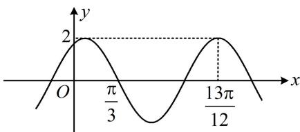

<!-- question-source:start -->
【例 2】(2021·全国甲卷) 已知函数 $f(x)=2\cos(\omega x+\varphi)$ 的部分

图象如图所示，则满足条件 $\left(f(x)-f\left(-\frac{7\pi}{4}\right)\right)\left(f(x)-f\left(\frac{4\pi}{3}\right)\right)>$

0 的最小正整数 x 为 \_\_\_\_.

(1)$ 介于 $f\left(\frac{\pi}{4}\right)$ 和 $f\left(\frac{\pi}{3}\right)$ 之间，所以 $x = 1$ 不满足不等式①，

$f
(2)$ 比 $f\left(\frac{\pi}{4}\right)$ 和 $f\left(\frac{\pi}{3}\right)$ 都小，所以 $x = 2$ 满足不等式①，故满足原不等式的最小正整数 $x$ 为2.
<!-- question-source:end -->

![[高中/总复习/教辅/一数常规版2026/第4章 三角函数/模块4：三角函数提高篇/第1节 三角函数图象性质综合问题/类型01_利用图象比较函数值大小/例题/answers/Q00050172A1.md]]
