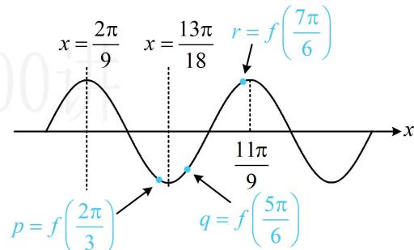

> [!faq]- 《第1节 三角函数图象性质综合问题》例题解析
>
> > [!success]- **【答案】** C
>
> > [!note]- **【分析】**
> > 本题未单列分析。
>
> > [!note]- **【解析】**
> > 解析：由题意， $f(x)$ 的最小正周期 $T=\frac{2\pi}{2}=\pi$ ， $f(x)\leq f\left(\frac{2\pi}{9}\right)\Rightarrow f(x)$ 在 $x=\frac{2\pi}{9}$ 处取得最大值，
> > 最大值处即为对称轴，知道一个最大值点和周期，可作出函数的草图，推断其它最值点.例如 $x=\frac{2\pi}{9}$ 右侧
> >
> > 的两条对称轴依次为 $x = \frac{2\pi}{9} + \frac{\pi}{2} = \frac{13\pi}{18}$ ， $x = \frac{2\pi}{9} + \pi = \frac{11\pi}{9}$ ，于是可直接在图中标注 $p, q, r$ 的位置，就能比较大小，如图， $p, q$ 都在 $x = \frac{13\pi}{18}$ 这个最小值点附近，可以看谁的自变量离 $x = \frac{13\pi}{18}$ 更远，谁就更大，因为 $\frac{5\pi}{6} - \frac{13\pi}{18} = \frac{\pi}{9} > \frac{13\pi}{18} - \frac{2\pi}{3} = \frac{\pi}{18}$ ，所以 $p < q$ ，由图可知 $q < r$ ，故 $p < q < r$ 。
> >
> > 
>
> > [!tip]- **【反思】**
> > 本题当然可以将最值点代入解析式求出 $\varphi$ ，再代值比较大小，但显然没有画图分析简便.
