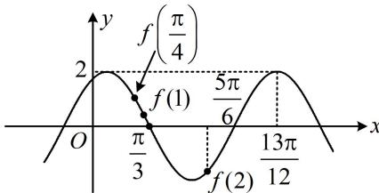

> [!faq]- 《第1节 三角函数图象性质综合问题》例题解析
>
> > [!success]- **【答案】** 2
>
> > [!note]- **【分析】**
> > 本题未单列分析。
>
> > [!note]- **【解析】**
> > 解析：由图可知， $\frac{13\pi}{12} - \frac{\pi}{3} = \frac{3}{4}T$ ，所以 $T = \pi$ ，于是可将 $f\left(-\frac{7\pi}{4}\right)$ 和 $f\left(\frac{4\pi}{3}\right)$ 化为 $f\left(\frac{\pi}{4}\right)$ 和 $f\left(\frac{\pi}{3}\right)$ ，便于标注，所以 $\left(f(x) - f\left(-\frac{7\pi}{4}\right)\right)\left(f(x) - f\left(\frac{4\pi}{3}\right)\right) > 0$ 即为 $\left(f(x) - f\left(\frac{\pi}{4}\right)\right)\left(f(x) - f\left(\frac{\pi}{3}\right)\right) > 0$ ①，我们直接把 $f\left(\frac{\pi}{4}\right)$ 和 $f\left(\frac{\pi}{3}\right)$ 在图中标出来，就能分析不等式①的最小正整数解了，如图， $f
> >
> >
> > 
>
> > [!tip]- **【反思】**
> > 本题也可根据图象求出 $f(x)$ 解析式，再分析所给不等式，但显然没有数形结合来得清晰快捷.
