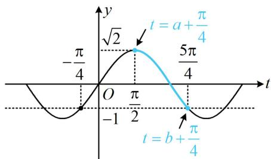
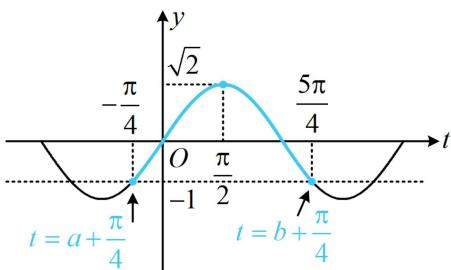

> [!faq]- 《第1节 三角函数图象性质综合问题》例题解析
>
> > [!success]- **【答案】** D
>
> > [!note]- **【分析】**
> > 本题未单列分析。
>
> > [!note]- **【解析】**
> > 解析：由题意， $f(x)=\sqrt{2}\sin\left(x+\frac{\pi}{4}\right)$ ，给了值域，考虑画图分析，为了便于作图，先将 $x+\frac{\pi}{4}$ 换元成t，
> > 令 $t = x + \frac{\pi}{4}$ ，则 $f(x) = \sqrt{2} \sin t$ ，当 $x \in [a, b]$ 时， $t \in \left[a + \frac{\pi}{4}, b + \frac{\pi}{4}\right]$ ，
> > 问题等价于 $y=\sqrt{2}\sin t$ 在 $\left[a+\frac{\pi}{4},b+\frac{\pi}{4}\right]$ 上的值域为 $[-1,\sqrt{2}]$ ，
> >
> > 怎样能使值域为 $[-1, \sqrt{2}]$ ，不妨结合值域的两个端点 -1 和 $\sqrt{2}$ 在图象上的位置来分析，首先， $\left[a + \frac{\pi}{4}, b + \frac{\pi}{4}\right]$ 肯定不足一个周期，否则值域必为 $[- \sqrt{2}, \sqrt{2}]$ ；其次， $\left[a + \frac{\pi}{4}, b + \frac{\pi}{4}\right]$ 内必有最大值点，如图，不妨假设区间 $\left[a + \frac{\pi}{4}, b + \frac{\pi}{4}\right]$ 内的最大值点为 $t = \frac{\pi}{2}$ ，则区间的左、右端点不能越过 $-\frac{\pi}{4}$ 和 $\frac{5\pi}{4}$ ，否则值域中必有小于-1的数，且左、右端点至少有一个与 $-\frac{\pi}{4}$ ， $\frac{5\pi}{4}$ 重合，否则函数的最小值大于-1，所以区间 $\left[a + \frac{\pi}{4}, b + \frac{\pi}{4}\right]$ 最窄的情形如图1，最宽的情形如图2，由图可知 $\left[\left(b + \frac{\pi}{4}\right) - \left(a + \frac{\pi}{4}\right)\right]_{\min} = \frac{3\pi}{4}$ ， $\left[\left(b + \frac{\pi}{4}\right) - \left(a + \frac{\pi}{4}\right)\right]_{\max} = \frac{3\pi}{2}$ ，即 $(b - a)_{\min} = \frac{3\pi}{4}$ ， $(b - a)_{\max} = \frac{3\pi}{2}$ ，故 $b - a$ 的取值范围是 $\left[\frac{3\pi}{4}, \frac{3\pi}{2}\right]$ .
> >
> >
> >   
> > 图1
> >
> >   
> > 图2
