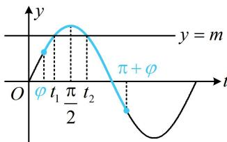

> [!faq]- 《第1节 三角函数图象性质综合问题》例题解析
>
> > [!success]- **【答案】** A
>
> > [!note]- **【分析】**
> > 本题未单列分析。
>
> > [!note]- **【解析】**
> > 解析：由题意， $f(x) = 2\sin \left(2x + \frac{\pi}{3}\right) + \cos \left(2x + \frac{\pi}{3}\right) = \sqrt{5}\sin \left(2x + \frac{\pi}{3} +\varphi\right),$
> >
> > 其中 $\cos \varphi = \frac{2\sqrt{5}}{5}$ ， $\sin \varphi = \frac{\sqrt{5}}{5}$ ，且 $\varphi \in \left(0, \frac{\pi}{2}\right)$ ，注意此处 $\varphi$ 不是变量，而是一个确定的非特殊锐角，由题意， $g(x) = f\left(x - \frac{\pi}{6}\right) = \sqrt{5} \sin \left[2\left(x - \frac{\pi}{6}\right) + \frac{\pi}{3} + \varphi\right] = \sqrt{5} \sin (2x + \varphi)$ ，
> >
> > 要研究方程 $g(x) = m$ 根的情况，考虑画图分析，为了便于作图，将 $2x + \varphi$ 换元成 $t$ 令 $t = 2x + \varphi$ ，则 $g(x) = \sqrt{5}\sin t$ ，当 $x\in \left[0,\frac{\pi}{2}\right]$ 时， $t\in [\varphi ,\pi +\varphi ]$ ，函数 $y = \sqrt{5}\sin t$ 的部分图象如图所示， $g(x) = m\Leftrightarrow \sqrt{5}\sin t = m$ ，因为 $g(x) = m$ 有两根 $x_{1}$ ， $x_{2}$ ，所以方程 $\sqrt{5}\sin t = m$ 有两根 $t_1$ ， $t_2$ 如图，直线 $y = m$ 与 $y = \sqrt{5}\sin t$ 在 $[\varphi ,\pi +\varphi ]$ 上的图象的两个交点的横坐标就是 $t_1$ ， $t_2$
> >
> > 由图可知，两个交点关于直线 $t = \frac{\pi}{2}$ 对称，所以 $\frac{t_1 + t_2}{2} = \frac{\pi}{2}$ ，
> >
> > 找到了 $t_1$ 和 $t_2$ 的关系，将变量 $t$ 换回成 $x$ ，就能转换成 $x_{1}$ 与 $x_{2}$ 的关系，又 $\left\{ \begin{array}{l} t_{1} = 2x_{1} + \varphi \\ t_{2} = 2x_{2} + \varphi \end{array} \right.$ ，两式相加整理得： $x_{1} + x_{2} = \frac{t_{1} + t_{2}}{2} -\varphi = \frac{\pi}{2} -\varphi$ 故 $\sin (x_1 + x_2) = \sin \left(\frac{\pi}{2} -\varphi\right) = \cos \varphi = \frac{2\sqrt{5}}{5}.$
> >
> > 
>
> > [!tip]- **【反思】**
> > 例 3 和例 4 的条件用代数的方法翻译较难，但我们结合图象来翻译，就会变得更直观.
