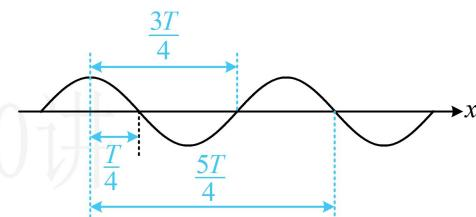

> [!faq]- 《第1节 三角函数图象性质综合问题》例题解析
>
> > [!success]- **【答案】** B
>
> > [!note]- **【分析】**
> > 本题未单列分析。
>
> > [!note]- **【解析】**
> > 解析：$f\left(\frac{5\pi}{8}\right)=\frac{1}{2}\Rightarrow x=\frac{5\pi}{8}$ 是 $f(x)$ 的最大值点， $f\left(\frac{11\pi}{8}\right)=0\Rightarrow x=\frac{11\pi}{8}$ 是 $f(x)$ 的零点，
> > 注意，与上题相比，本题所给的零点与最值点不一定相邻。这样虽然不能直接得到周期 T，求出 $\omega$ ，但它
> > 们之间的距离必为 $\frac{T}{4}$ 的正奇数倍，理由如图所示，可以比较直观理解，所以仍可由此找到 $\omega$ 的通解，
> > 所以 $\frac{11\pi}{8}-\frac{5\pi}{8}=(2n-1)\cdot\frac{T}{4}(n\in\mathbb{N}^{*})$ ，从而 $\frac{3\pi}{4}=(2n-1)\cdot\frac{\pi}{2\omega}$ ，故 $\omega=\frac{2(2n-1)}{3}$ 又 $f(x)$ 相邻两个零点之间的距离大于 $\pi$ ，相邻的零点之间的距离为 $\frac{T}{2}$ ，所以 $\frac{T}{2} > \pi$ ，故 $T = \frac{2\pi}{\omega} > 2\pi$ 从而 $0 < \omega < 1$ ，结合 $\omega = \frac{2(2n-1)}{3}$ 可得 n 只能取 1，所以 $\omega = \frac{2}{3}$ ，故 $f(x) = \frac{1}{2} \sin\left(\frac{2}{3}x + \varphi\right)$ 再来求 $\varphi$ ，可代最值点，因为 $f\left(\frac{5\pi}{8}\right)=\frac{1}{2}$ ，所以 $\frac{1}{2}\sin\left(\frac{2}{3}\times\frac{5\pi}{8}+\varphi\right)=\frac{1}{2}$ ，故 $\sin\left(\frac{5\pi}{12}+\varphi\right)=1$ 又 $|\varphi|<\pi$ ，所以 $-\pi<\varphi<\pi$ ，从而 $-\frac{7\pi}{12}<\frac{5\pi}{12}+\varphi<\frac{17\pi}{12}$ 故 $\frac{5\pi}{12}+\varphi=\frac{\pi}{2}$ ，所以 $\varphi=\frac{\pi}{12}$ .
> >
> >
> > 
>
> > [!tip]- **【总结】**
> > 对于函数 $y = A\sin (\omega x + \varphi)$ ，当给出多个对称轴、零点这类关
> >
> > 键点时，若它们相邻，则可直接求周期，得到 $\omega$ ；若没说相邻，则只能先建立 $\omega$ 的通解，再由其它条件筛选 $\omega$ 。具体来说，对称轴与对称中心之间的距离是 $\frac{T}{4}$ 的正奇数倍，可表示为 $(2n - 1) \cdot \frac{T}{4}$ ，对称轴与对称轴、对称中心与对称中心的距离都是 $\frac{T}{2}$ 的正整数倍，可表示为 $n \cdot \frac{T}{2}$ ，其中 $n \in \mathbf{N}^*$ 。
