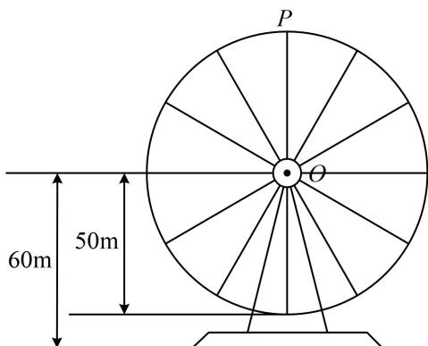
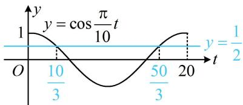

> [!faq]- 《第1节 三角函数图象性质综合问题》例题解析
>
> > [!success]- **【答案】** D
>
> > [!note]- **【分析】**
> > 本题未单列分析。
>
> > [!note]- **【解析】**
> > D. 摩天轮转动一圈, 点 $P$ 距离地面的高度不低于 $85 \mathrm{~m}$ 的时间长为 $\frac{20}{3} \mathrm{~min}$
> >
> > 
> >
> > 解析: 诸多选项涉及点 $P$ 距离地面高度和时间, 故先建立二者的函数关系, 可设该高度为 $f(t) = A \sin (\omega t + \varphi) + B$ , 其中 $A > 0$ , $\omega > 0$ . 只要求出 $A, B, \omega, \varphi$ , 解析式就有了, 先由最大、最小值求 $A$ 和 $B$ ,
> >
> > 由题意，点 $P$ 最高为 $110\mathrm{m}$ ，最低为 $10\mathrm{m}$ ，所以 $\left\{ \begin{array}{l} A + B = 110 \\ -A + B = 10 \end{array} \right.$ ，解得： $A = 50$ ， $B = 60$ ，
> >
> > 再由初始位置求 $\varphi$ ，初始位置在最高点，所以 $f(0) = 50\sin \varphi + 60 = 110$ ，从而 $\sin \varphi = 1$ ，故 $\varphi = \frac{\pi}{2}$ ，
> >
> > 最后由周期求 $\omega$ ，由题意， $20\mathrm{min}$ 转一圈，所以 $T = 20$ ，故 $\omega = \frac{2\pi}{T} = \frac{\pi}{10}$
> >
> > 所以 $f(t) = 50\sin \left(\frac{\pi}{10} t + \frac{\pi}{2}\right) + 60 = 50\cos \frac{\pi}{10} t + 60$
> >
> > A 项， $f
> > (10)=50\cos\left(\frac{\pi}{10}\times10\right)+60=50\cos\pi+60=10$ ，故 A 项错误；
> >
> > B 项，若摩天轮转速减半，则转动一周的时间加倍，故 B 项错误；
> >
> > C项， $f
> > (17) = 50\cos \left(\frac{\pi}{10}\times 17\right) + 60 = 50\cos \frac{17\pi}{10} +60$ ， $f
> > (42) = 50\cos \left(\frac{\pi}{10}\times 42\right) + 60 = 50\cos \frac{21\pi}{5} +60,$
> >
> > 要判断 C 项是否正确，只需看 $\cos\frac{17\pi}{10}$ 和 $\cos\frac{21\pi}{5}$ 是否相等，可用诱导公式化为锐角三角函数来看，
> >
> > $$
> > \cos \frac {1 7 \pi}{1 0} = \cos \left(\frac {1 7 \pi}{1 0} - 2 \pi\right) = \cos \left(- \frac {3 \pi}{1 0}\right) = \cos \frac {3 \pi}{1 0}, \quad \cos \frac {2 1 \pi}{5} = \cos \left(4 \pi + \frac {\pi}{5}\right) = \cos \frac {\pi}{5},
> > $$
> >
> > 因为 $\cos \frac{3\pi}{10} \neq \cos \frac{\pi}{5}$ ，所以 $f
> > 如图，在[0,20)这个周期内， $\cos \frac{\pi}{10} t\geq \frac{1}{2}$ 的解集为 $\left[0,\frac{10}{3}\right]\cup \left[\frac{50}{3},20\right)$
> >
> > 故点 $P$ 距离地面的高度不低于 $85\mathrm{m}$ 的时间长为 $\frac{10}{3} +\left(20 - \frac{50}{3}\right) = \frac{20}{3}\mathrm{min}$ ，故D项正确.
> >
> > 
