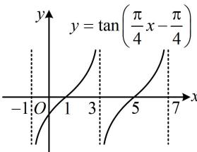
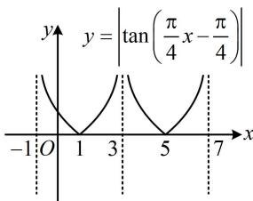

> [!faq]- 《第2节 非合一结构的图象性质综合题》参考答案
>
> > [!success]- **【答案】** C
>
> > [!note]- **【分析】**
> > 本题未单列分析。
>
> > [!note]- **【解析】**
> > C
> > 解析：题干给了周期，可由此求 $\omega$ ，正切类函数整体加绝对值不改变周期， $y=\left|\tan(\omega x-\omega)\right|$ 的最小正周期与 $y=\tan(\omega x-\omega)$ 相同，
> > 因为 $y = \tan(\omega x - \omega)$ 的最小正周期 $T = \frac{\pi}{\omega}$ ，所以 $\frac{\pi}{\omega} = 4$ ，
> > 从而 $\omega=\frac{\pi}{4}$ ，故 $f(x)=\left|\tan\left(\frac{\pi}{4}x-\frac{\pi}{4}\right)\right|$ 函数 $y=\tan\left(\frac{\pi}{4}x-\frac{\pi}{4}\right)$ 的图象可通过找零点和周期快速画出，再留上翻下即得 $f(x)$ 的图象，故画图判断选项，
> > 令 $\frac{\pi}{4}x - \frac{\pi}{4} = k\pi$ 得 $x = 4k + 1 (k \in \mathbf{Z})$ ，所以 $y = \tan\left(\frac{\pi}{4}x - \frac{\pi}{4}\right)$ 有零点 $x=1,5,\cdots$ ，结合周期为 4 可得其大致图象如图 1，
> > 所以 $f(x)=\left|\tan\left(\frac{\pi}{4}x-\frac{\pi}{4}\right)\right|$ 的大致图象如图 2，
> > 由图可知 $f(x)$ 在 $\left(-1,\frac{1}{3}\right)$ 上 $\searrow$ ；在 $\left(\frac{1}{3},\frac{5}{3}\right)$ 上先 $\searrow$ 后 $\nearrow$ ;
> >
> > 在 $\left(\frac{5}{3},3\right)$ 上↗；在(3,4)上↘，故选C.
> >
> >   
> > 图1
> >
> >   
> > 图2
