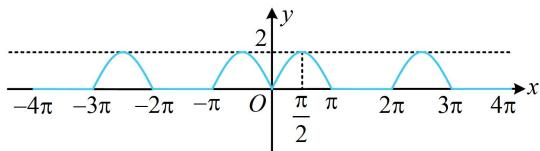

> [!faq]- 《第2节 非合一结构的图象性质综合题》参考答案
>
> > [!success]- **【答案】** C
>
> > [!note]- **【分析】**
> > 本题未单列分析。
>
> > [!note]- **【解析】**
> > ## 3. (2019·新课标Ⅰ卷·★★★☆)
> >
> > 关于函数 $f(x) = \sin |x| + |\sin x|$ 有下述四个结论：
> > - **①**：$f(x)$ 是偶函数；
> > - **②**：$f(x)$ 在区间 $\left(\frac{\pi}{2},\pi\right)$ 单调递增；
> > - **③**：$f(x)$ 在 $[- \pi, \pi]$ 有4个零点；
> > - **④**：$f(x)$ 的最大值为 2.
> >
> > 其中所有正确结论的编号是（）
> > A. ①②④ B. ②④ C. ①④ D. ①③
> >
> > 解法1：①项， $f(-x) = \sin | - x| + |\sin (-x)| = \sin |x| + |\sin x|$ $= \sin |x| + |\sin x| = f(x)$ ，所以 $f(x)$ 为偶函数，故①项正确；
> > - **②**：项，限定了 $x$ 的范围，先据此去掉绝对值，当 $x\in \left(\frac{\pi}{2},\pi\right)$ 时， $\sin x > 0$ ，所以 $f(x) = 2\sin x$ ，从而 $f(x)$ 在区间 $\left(\frac{\pi}{2},\pi\right)$ 上↘，故②项错误；
> > - **③**：项，我们已经得出了 $f(x)$ 是偶函数，可先看 $[0,\pi ]$ 上的零当 $x\in [0,\pi ]$ 时， $\sin x\geq 0$ ，所以 $f(x) = \sin x + \sin x = 2\sin x$ 故 $f(x) = 0$ 即为 $2\sin x = 0$ ，解得： $x = 0$ 或 $\pi$ 由偶函数的对称性知-π也是 $f(x)$ 的零点，所以 $f(x)$ 在 $[- \pi ,\pi ]$ 有3个零点，故③项错误；
> > - **④**：项，因为 $\left\{ \begin{array}{l}\sin |x|\leq 1\\ |\sin x|\leq 1 \end{array} \right.$ ，所以 $f(x) = \sin |x| + |\sin x|\leq 2$ 又 $f\left(\frac{\pi}{2}\right) = 2$ ，所以 $f(x)_{\max} = 2$ ，故④项正确.
> > - **③**：项，我们已经得出了 $f(x)$ 是偶函数，可先看 $[0, \pi]$ 上的零点情况，此时可去掉绝对值，当 $x \in [0, \pi]$ 时， $\sin x \geq 0$ ，所以 $f(x) = \sin x + \sin x = 2\sin x$ ，
> > 故 $f(x) = 0$ 即为 $2\sin x = 0$ ，解得： $x = 0$ 或 $\pi$ ，
> > 由偶函数的对称性知 $-\pi$ 也是 $f(x)$ 的零点，
> > 所以 $f(x)$ 在 $[- \pi, \pi]$ 有3个零点，故③项错误；
> > - **④**：项，因为 $\left\{ \begin{array}{l} \sin |x| \leq 1 \\ |\sin x| \leq 1 \end{array} \right.$ ，所以 $f(x) = \sin |x| + |\sin x| \leq 2$ ，
> > 又 $f\left( \frac{\pi}{2} \right) = 2$ ，所以 $f(x)_{\max} = 2$ ，故④项正确.
> >
> > 解法2：判断出选项①后，其余选项也可通过画图来判断，因为 $f(x)$ 是偶函数，所以可先画 $[0, +\infty)$ 上的图象，再由对称性画出 $(- \infty, 0)$ 上的图象，当 $x \in [0, +\infty)$ 时， $f(x) = \sin x + |\sin x|$ ， $f(x + 2\pi) = \sin (x + 2\pi) + |\sin (x + 2\pi)| = \sin x + |\sin x| = f(x)$ ，所以 $f(x)$ 在 $[0, +\infty)$ 上的图象以 $2\pi$ 为周期重复出现，先看 $[0, 2\pi)$ 的情形，此时可通过讨论去绝对值，当 $0 \leq x \leq \pi$ 时， $\sin x \geq 0$ ，故 $f(x) = \sin x + \sin x = 2\sin x$ ；
> >
> > 当 $\pi < x < 2\pi$ 时， $\sin x < 0$ ，故 $f(x) = \sin x + (-\sin x) = 0$ ；
> >
> > 所以 $f(x)$ 的部分图象如图中蓝色曲线，
> >
> > 由图可知 $f(x)$ 在 $\left(\frac{\pi}{2},\pi\right)$ 上 $\searrow$ ， $f(x)$ 在 $[- \pi, \pi]$ 上有3个
> >
> > 零点， $f(x)_{\max}=2$ ，所以选项②③错误，④正确.
> >
> > 
