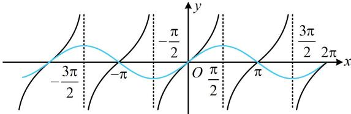
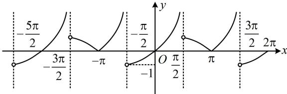

> [!faq]- 《第2节 非合一结构的图象性质综合题》参考答案
>
> > [!success]- **【答案】** AB
>
> > [!note]- **【分析】**
> > 本题未单列分析。
>
> > [!note]- **【解析】**
> > AB
> >
> > 解析：本题 $f(x)$ 是分段函数，两段上的解析式都很简单，可以画出 $f(x)$ 的图象，来判断选项，
> >
> > $$
> > y = \tan x
> > $$
> >
> > $$
> > y = \sin x
> > $$
> >
> > 二者的公共周期是 $2 \pi$ ，不妨先在 $(0, 2 \pi)$ 上分段考虑，
> >
> > 在 $\left(0,\frac{\pi}{2}\right)$ 那一段， $\left\{\begin{aligned}0<\cos x&<1\\ 0<\sin x&<1\end{aligned}\right.$ ，所以 $\tan x=\frac{\sin x}{\cos x}>\sin x$ ，
> >
> > 故 $y = \tan x$ 在 $\left(0, \frac{\pi}{2}\right)$ 上的图象始终在 $y = \sin x$ 图象的上方，
> >
> > 其余部分 $\tan x$ 与 $\sin x$ 的大小由图1容易看出，
> >
> > 故可画出 $f(x)$ 的图象如图2，由图可知A项和B项正确；
> >
> > 对于 C 项，我们可先在 $\left(-\frac{\pi}{2},\frac{\pi}{2}\right)\cup\left(\frac{\pi}{2},\frac{3\pi}{2}\right)$ 这个周期上求 $f(x)\leq0$ 的解集，再加上 $2k\pi$ 即为全部的解，由图可知 $f(x)\leq0$ 在 $\left(-\frac{\pi}{2},\frac{\pi}{2}\right)\cup\left(\frac{\pi}{2},\frac{3\pi}{2}\right)$ 上的解集为 $(- \frac{\pi}{2},0]\cup\{\pi\}$ ，
> >
> > 所以全部的解集为 $\left(2k\pi -\frac{\pi}{2},2k\pi \right]\bigcup \{\pi +2k\pi \} (k\in \mathbf{Z})$ ，故C项错误；
> >
> > 函数 $f(x)$ 的单调递增区间除了D选项给的那部分，还有
> >
> > $\left(2k\pi - \frac{\pi}{2}, 2k\pi\right]$ ，例如 $\left(-\frac{\pi}{2}, 0\right]$ ，故D项错误.
> >
> >   
> > 图1
> >
> >   
> > 图2
