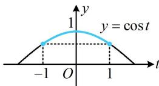

> [!faq]- 《第2节 非合一结构的图象性质综合题》参考答案
>
> > [!success]- **【答案】** ACD
>
> > [!note]- **【分析】**
> > 本题未单列分析。
>
> > [!note]- **【解析】**
> > ACD
> > 解法1：A项， $f(x+2\pi)=\cos(\sin(x+2\pi))=\cos(\sin x)$ $=f(x)\Rightarrow f(x)$ 的一个周期是 $2\pi$ ，故 A 项正确；
> > B 项，要求值域，可将 $\sin x$ 换元成 t，再画图分析，
> > 设 $t=\sin x$ ，则 $f(x)=\cos t$ ，且 $-1\leq t\leq1$ 函数 y = cos t 的部分图象如图，由图可知当 $t \in [-1, 1]$ 时， $\cos1 \leq \cos t \leq 1$ ，从而 $f(x)$ 的值域是 $[\cos1, 1]$ ，故 B 项错误；
> > C 项，要判断 $f(x)$ 是否关于 $x=\pi$ 对称，就看 $f(2\pi-x)=f(x)$ 是否成立， $f(2\pi-x)=\cos(\sin(2\pi-x))=\cos(-\sin x)=\cos(\sin x)$ $=f(x)\Rightarrow f(x)$ 的图象关于直线 $x=\pi$ 对称，故 C 项正确；
> > D 项，判断极值点就是判断单调性，这里的函数可以看成复合函数，用同增异减准则来判断，
> > 函数 $y=f(x)$ 是由 $y=\cos t$ 和 $t=\sin x$ 复合而成，
> > 结合内层函数 $t=\sin x$ 的单调区间，我们把 $(0,\pi)$ 分成 $\left(0,\frac{\pi}{2}\right)$ 和 $\left(\frac{\pi}{2},\pi\right)$ 两段分别考虑，
> > 当 $x\in\left(0,\frac{\pi}{2}\right)$ 时， $t=\sin x\nearrow$ ，且 $t\in(0,1)$ 因为 $y = \cos t$ 在 $(0,1)$ 上 $\searrow$ ，所以 $f(x)$ 在 $\left(0,\frac{\pi}{2}\right)$ 上 $\searrow$ 当 $x\in\left(\frac{\pi}{2},\pi\right)$ 时， $t=\sin x\nearrow$ ，且 $t\in(0,1)$ 因为 $y = \cos t$ 在 $(0,1)$ 上也 $\searrow$ ，所以 $f(x)$ 在 $\left(\frac{\pi}{2},\pi\right)$ 上 $\nearrow$ 从而 $\frac{\pi}{2}$ 是 $f(x)$ 在 $(0,\pi)$ 上唯一的极值点，故 D 项正确.
> >
> > 解法2：选项A、B、C的判断方法同解法1，要判断选项D，也可通过求导来分析单调性，由题意， $f'(x) = -\sin(\sin x)\cos x$ ，下面先判断 $\sin(\sin x)$ 这部分的正负，因为 $0 < x < \pi$ ，所以 $0 < \sin x \leq 1$ ，从而 $\sin(\sin x) > 0$ ，故 $f'(x) > 0 \Leftrightarrow \cos x < 0 \Leftrightarrow \frac{\pi}{2} < x < \pi$ ， $f'(x) < 0 \Leftrightarrow \cos x > 0 \Leftrightarrow 0 < x < \frac{\pi}{2}$ ，所以 $f(x)$ 在 $\left(0, \frac{\pi}{2}\right)$ 上 $\searrow$ ，在 $\left(\frac{\pi}{2}, \pi\right)$ 上 $\nearrow$ ，故 $\frac{\pi}{2}$ 是 $f(x)$ 在区间 $(0, \pi)$ 上唯一的极值点.
> >
> > 
