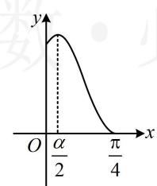
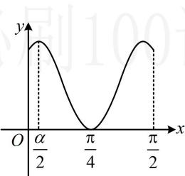
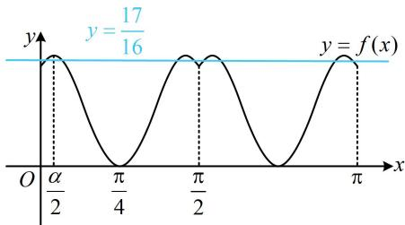

> [!faq]- 《第2节 非合一结构的图象性质综合题》参考答案
>
> > [!success]- **【答案】** B
>
> > [!note]- **【分析】**
> > 本题未单列分析。
>
> > [!note]- **【解析】**
> > （2024·广西模拟·★★★★★）（多选）
> > 已知函数 $f(x)=\left|\sin 2x\right|+\cos 4x$ ，则（）
> > A. $f(x)$ 的最大值为 $\frac{5}{4}$ B. $f(x)$ 的最小正周期为 $\frac{\pi}{2}$ C. 曲线 $y = f(x)$ 关于直线 $x = \frac{k\pi}{4} (k \in \mathbf{Z})$ 轴对称
> > D. 当 $x \in [0, \pi]$ 时，函数 $g(x) = 16f(x) - 17$ 有 9 个零点
> >
> > 解析：A项，解析式中涉及的角有 $4x$ 和 $2x$ ，不方便直接分析最值，考虑统一角度，可对 $\cos 4x$ 用二倍角公式，同时为了让函数名也统一，我们选择 $\cos 4x = 1 - 2\sin^2 2x$ ， $f(x) = |\sin 2x| + \cos 4x = |\sin 2x| + 1 - 2|\sin 2x|^2$ $= -2\left(|\sin 2x| - \frac{1}{4}\right)^2 + \frac{9}{8}$ ，其中 $|\sin 2x| \in [0,1]$ ，所以当 $|\sin 2x| = \frac{1}{4}$ 时， $f(x)$ 有最大值，且最大值为 $\frac{9}{8}$ ，故A项错误；  
> > B项， $f\left(x + \frac{\pi}{2}\right) = \left|\sin 2\left(x + \frac{\pi}{2}\right)\right| + \cos 4\left(x + \frac{\pi}{2}\right)$ $= |\sin (2x + \pi)| + \cos (4x + 2\pi) = |- \sin 2x| + \cos 4x$ $= |\sin 2x| + \cos 4x = f(x)$ ，所以 $\frac{\pi}{2}$ 是 $f(x)$ 的周期，那 $\frac{\pi}{2}$ 是最小正周期吗？结合 $|\sin 2x|$ 和 $\cos 4x$ 的最小正周期都是 $\frac{\pi}{2}$ 可以猜想 $f(x)$ 的最小正周期也是 $\frac{\pi}{2}$ ，怎样严格论证？可考虑分析 $f(x)$ 在 $\left[0, \frac{\pi}{2}\right]$ 这个周期上的单调性，画出其草图来看，当 $x \in \left[0, \frac{\pi}{2}\right]$ 时， $2x \in [0, \pi]$ ，所以 $\sin 2x \geq 0$ 故 $f(x) = |\sin 2x| + \cos 4x = \sin 2x + \cos 4x$ ，怎样分析 $f(x)$ 的单调性？考虑到其结构相对较复杂，我们试试求导， $f'(x) = 2\cos 2x - 4\sin 4x = 2\cos 2x - 8\sin 2x\cos 2x$ $= 2\cos 2x(1 - 4\sin 2x)$ ，
> >
> > 当 $x \in \left[0, \frac{\pi}{4}\right]$ 时， $2x \in \left[0, \frac{\pi}{2}\right]$ ，所以 $\cos 2x \geq 0$
> >
> > 故 $f^{\prime}(x)\geq 0\Leftrightarrow 1 - 4\sin 2x\geq 0\Leftrightarrow \sin 2x\leq \frac{1}{4}$ ①，
> >
> > 在 $\left[0, \frac{\pi}{2}\right]$ 上存在唯一的 $\alpha$ 使 $\sin \alpha = \frac{1}{4}$ ,
> >
> > 且当 $0 \leq x \leq \alpha$ 时， $\sin x \leq \frac{1}{4}$ ，当 $\alpha \leq x \leq \frac{\pi}{2}$ 时， $\sin x \geq \frac{1}{4}$ ，
> >
> > $$
> > 0 \leq 2 x \leq \alpha
> > $$
> >
> > $$
> > 0 \leq x \leq \frac {\alpha}{2}
> > $$
> >
> > 同理， $f^{\prime}(x)\leq 0\Leftrightarrow \frac{\alpha}{2}\leq x\leq \frac{\pi}{4}$
> >
> > 所以 $f(x)$ 在 $\left[0, \frac{\alpha}{2}\right]$ 上 $\nearrow$ ，在 $\left[\frac{\alpha}{2}, \frac{\pi}{4}\right]$ 上 $\searrow$ ，
> >
> > 故 $f(x)$ 在 $\left[0, \frac{\pi}{4}\right]$ 上的大致图象如图1，
> >
> > 又因为 $f\left(\frac{\pi}{2} - x\right) = \left|\sin 2\left(\frac{\pi}{2} - x\right)\right| + \cos 4\left(\frac{\pi}{2} - x\right)$
> >
> > $$
> > = \left| \sin (\pi - 2 x) \right| + \cos (2 \pi - 4 x) = \left| \sin 2 x \right| + \cos 4 x = f (x),
> > $$
> >
> > 所以 $f(x)$ 的图象关于直线 $x = \frac{\pi}{4}$ 对称，
> >
> > 故 $f(x)$ 在 $\left[0, \frac{\pi}{2}\right]$ 上的大致图象如图2，
> >
> > 由图2可知， $f(x)$ 没有比 $\frac{\pi}{2}$ 更小的周期，
> >
> > 所以 $\frac{\pi}{2}$ 是 $f(x)$ 的最小正周期，故B项正确；
> >
> >   
> > 图1
> >
> >   
> > 图2
> >
> > C项，若 $f(x)$ 关于直线 $x = \frac{k\pi}{4}$ 对称，则应有 $f\left(\frac{k\pi}{2} - x\right)$
> >
> > $=f(x)$ ，故据此判断，
> >
> > $$
> > f \left(\frac {k \pi}{2} - x\right) = \left| \sin 2 \left(\frac {k \pi}{2} - x\right) \right| + \cos 4 \left(\frac {k \pi}{2} - x\right)
> > $$
> >
> > $$
> > = \left| \sin (k \pi - 2 x) \right| + \cos (2 k \pi - 4 x) = \left| \pm \sin 2 x \right| + \cos (- 4 x)
> > $$
> >
> > $= \left|\sin 2x\right| + \cos 4x = f(x)(k \in \mathbf{Z})$ ，所以曲线 $y = f(x)$ 关于直线 $x = \frac{k\pi}{4} (k \in \mathbf{Z})$ 轴对称，故C项正确；
> >
> > D 项，显然解方程不易，对于零点个数问题，也常通过画图看交点个数，这里已有 $f(x)$ 一个周期内的草图，故可直接画图， $g(x) = 0 \Leftrightarrow 16f(x) - 17 = 0 \Leftrightarrow f(x) = \frac{17}{16}$ ，
> >
> > 因为 $f(0) = 1 < \frac{17}{16}$ ， $f(x)_{\max} = \frac{9}{8} > \frac{17}{16}$ ，所以如图3，
> >
> > 直线 $y = \frac{17}{16}$ 与 $y = f(x)$ 在 $[0, \pi]$ 上的图象有8个交点，
> >
> > 从而 $g(x)$ 在 $[0,\pi]$ 上有 8 个零点，故 D 项错误.
> >
> >   
> > 图3
> >
> > 一数·必刷100讲
