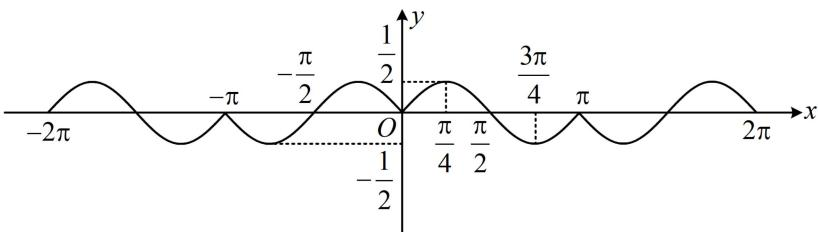

> [!faq]- 《第2节 非合一结构的图象性质综合题》例题解析
>
> > [!success]- **【答案】** BCD
>
> > [!note]- **【分析】**
> > 本题未单列分析。
>
> > [!note]- **【解析】**
> > A. $f(x)$ 的最小正周期是 $4\pi$ B. $f(x)$ 的值域是 $\left[-\frac{1}{2}, \frac{1}{2}\right]$ C. $f(x)$ 在区间 $\left(\frac{\pi}{4}, \frac{3\pi}{4}\right)$ 上单调递减
> > D. $f(x)$ 的图象关于点 $\left(\frac{\pi}{2}, 0\right)$ 对称
> >
> > 解析：A 项， $\sin x$ 和 $\cos x$ 的周期都是 $2\pi$ ，所以猜想 $2\pi$ 是 $f(x)$ 的周期，可用周期的定义式来验证， $f(x+2\pi)=|\sin(x+2\pi)|\cos(x+2\pi)=|\sin x|\cos x=f(x)\Rightarrow2\pi$ 是 $f(x)$ 的周期，故 A 项错误；
> > B 项，已知了 $2\pi$ 是周期，不妨在 $[0,2\pi)$ 这个周期内来求值域，可讨论 $\sin x$ 的正负，去掉绝对值，
> > 当 $0 \leq x \leq \pi$ 时， $\sin x \geq 0,\quad f(x)=\sin x\cos x=\frac{1}{2}\sin2x;$ 当 $\pi < x < 2\pi$ 时， $\sin x < 0,\quad f(x) = -\sin x \cos x = -\frac{1}{2} \sin 2x;$
> >
> > 结合 $f(x)$ 周期为 $2\pi$ 可得 $f(x)$ 的大致图象如图，由图可知 $f(x)$ 的值域为 $\left[-\frac{1}{2}, \frac{1}{2}\right]$ ，故B项正确；
> >
> > C 项，由图可知 $f(x)$ 在 $\left(\frac{\pi}{4}, \frac{3\pi}{4}\right)$ 上 $\searrow$ ，故 C 项正确；
> >
> > D 项, 观察图形可发现 D 项正确, 若没看出来图象关于 $\left(\frac{\pi}{2}, 0\right)$ 对称, 也可用对称结论来判断. $f(x)$ 是否关于点 $\left(\frac{\pi}{2}, 0\right)$ 对称, 取决于 $f(x + \pi) + f(-x) = 0$ 是否成立,
> >
> > 因为 $f(x + \pi) + f(-x) = |\sin (x + \pi)|\cos (x + \pi) + |\sin (-x)|\cos (-x) = |- \sin x|(-\cos x) + |- \sin x|\cos x$ $= -|\sin x|\cos x + |\sin x|\cos x = 0$ ，所以 $f(x)$ 的图象关于点 $\left(\frac{\pi}{2},0\right)$ 对称，故D项正确.
> >
> >
> > 
>
> > [!tip]- **【反思】**
> > 遇到让判断 $f(x)$ 的图象是否关于某点或某直线对称的问题，在第三章的第一模块“抽象函数问题”有详细归纳，如有疑惑可以查阅.
