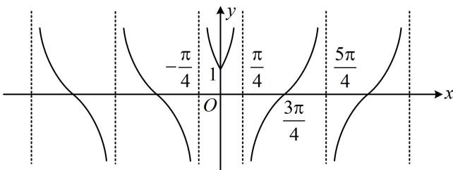

> [!faq]- 《第2节 非合一结构的图象性质综合题》例题解析
>
> > [!success]- **【答案】** AC
>
> > [!note]- **【分析】**
> > 本题未单列分析。
>
> > [!note]- **【解析】**
> > A. $f(x)$ 的图象关于 $y$ 轴对称
> > B. $f(x)$ 的最小正周期为 $\pi$ C. $f(x)$ 在 $\left(0, \frac{\pi}{4}\right)$ 上单调递增
> > D. $f(x)$ 的图象关于点 $\left(\frac{3\pi}{4}, 0\right)$ 对称
> >
> > 解析： $f(-x) = \tan \left(\left| -x\right| + \frac{\pi}{4}\right) = \tan \left(\left|x\right| + \frac{\pi}{4}\right) = f(x)\Rightarrow f(x)$ 为偶函数，其图象关于 $y$ 轴对称，故A项正确；
> >
> > 剩下的三个选项都可以通过画出 $f(x)$ 的图象来判断，因为 $f(x)$ 是偶函数，所以先画 $f(x)$ 在 $[0, +\infty)$ 上的图象，再对称翻折到 $y$ 轴左侧即可，
> >
> > 当 $x \geq 0$ 时， $f(x) = \tan \left(x + \frac{\pi}{4}\right)$ ，它就是把 $y = \tan x$ 左移了 $\frac{\pi}{4}$ 个单位，（只取 $[0, +\infty)$ 的部分）  
> > 所以 $f(x)$ 的图象如图，由图可知， $f(x)$ 不是周期函数，其图象也没有对称中心，所以选项 B、D 错误；  
> > 而 $f(x)$ 在 $\left(0, \frac{\pi}{4}\right)$ 上 $\nearrow$ ，故 C 项正确.
> >
> > 
>
> > [!tip]- **【总结】**
> > 若绝对值套在函数外面，则可按函数值的正负讨论，如有周期，则可在一个周期内去绝对值研究；若绝对值加在自变量 $x$ 上，则按 $x$ 的正负分类讨论。另外，若能画图，一般画图分析更直观。
