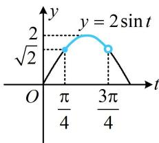
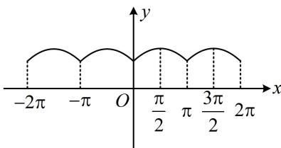

> [!faq]- 《第2节 非合一结构的图象性质综合题》例题解析
>
> > [!success]- **【答案】** AC
>
> > [!note]- **【分析】**
> > 本题未单列分析。
>
> > [!note]- **【解析】**
> > 解析：A项， $f(x)$ 的定义域为 $\mathbf{R}$ ，且 $f(-x) = \sqrt{1 + \cos(-x)} + \sqrt{1 - \cos(-x)} = \sqrt{1 + \cos x} + \sqrt{1 - \cos x} = f(x)$ ，所以 $f(x)$ 是偶函数，故A项正确；
> >
> > B 项， $2\pi$ 显然是 $f(x)$ 的周期，但是不是最小正周期呢？常常会尝试它的一半，看看 $\pi$ 是否为周期， $f(x+\pi)=\sqrt{1+\cos(x+\pi)}+\sqrt{1-\cos(x+\pi)}=\sqrt{1-\cos x}+\sqrt{1+\cos x}=f(x)\Rightarrow\pi$ 是 $f(x)$ 的一个周期，
> >
> > 所以 $f(x)$ 的最小正周期不是 $2\pi$ ，故B项错误；
> >
> > C项，要求值域，先化简 $f(x)$ 的解析式，看到 $1 + \cos x$ 和 $1 - \cos x$ ，自然想到升次公式，
> >
> > $$
> > f (x) = \sqrt {1 + \cos x} + \sqrt {1 - \cos x} = \sqrt {2 \cos^ {2} \frac {x}{2}} + \sqrt {2 \sin^ {2} \frac {x}{2}} = \sqrt {2} \left(\left| \cos \frac {x}{2} \right| + \left| \sin \frac {x}{2} \right|\right),
> > $$
> >
> > 根号已经去掉了，但还有绝对值，前面我们已经得到了 $\pi$ 是 $f(x)$ 的一个周期，所以可在 $[0, \pi)$ 这个周期内考虑，先去绝对值，再求值域，当 $x \in [0, \pi)$ 时， $\frac{x}{2} \in \left[0, \frac{\pi}{2}\right)$ ，所以 $\cos \frac{x}{2} > 0$ ， $\sin \frac{x}{2} \geq 0$ ，从而 $f(x) = \sqrt{2} \left( \cos \frac{x}{2} + \sin \frac{x}{2} \right) = 2 \sin \left( \frac{x}{2} + \frac{\pi}{4} \right)$ ，要求此函数的值域，可将 $\frac{x}{2} + \frac{\pi}{4}$ 换元成 $t$ ，借助 $y = 2 \sin t$ 的图象来分析，令 $t = \frac{x}{2} + \frac{\pi}{4}$ ，则 $f(x) = 2 \sin t$ ，因为 $0 \leq x < \pi$ ，所以 $\frac{\pi}{4} \leq t < \frac{3\pi}{4}$ ，
> >
> > 函数 $y = 2\sin t$ 的部分图象如图1所示，由图可知 $f(x)$ 的值域为 $[\sqrt{2},2]$ ，故C项正确；  
> > D项，由C项知当 $x\in [0,\pi)$ 时， $f(x) = 2\sin \left(\frac{x}{2} +\frac{\pi}{4}\right)$ ，所以 $f(x)$ 的部分图象如图2，  
> > 由图可知 $f(x)$ 的图象相邻两条对称轴间的距离为 $\frac{\pi}{2}$ ，故D项错误.
> >
> >   
> > 图1
> >
> >   
> > 图2
