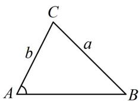
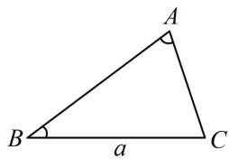
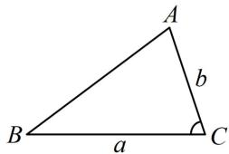

<!-- source-part:1 pages:1-5 -->

# 模块一 相关定理的基本应用

# 第1节 正弦定理、余弦定理基础模型（★★）

## 内容提要

解三角形主要用正弦定理和余弦定理, 若涉及面积, 还需用到面积公式, 下面先梳理有关的基础知识和基本方法. (如无特别说明, 本章的 $a, b, c$ 均指 $\triangle ABC$ 的内角 $A, B, C$ 的对边)

1. 基础知识

①正弦定理： $\frac{a}{\sin A} = \frac{b}{\sin B} = \frac{c}{\sin C} = 2R$ ，其中 $R$ 为 $\triangle ABC$ 的外接圆半径.

②余弦定理： $a^2 = b^2 +c^2 -2bc\cos A$ ， $b^{2} = a^{2} + c^{2} - 2ac\cos B$ ， $c^2 = a^2 +b^2 -2ab\cos C$

③余弦定理推论： $\cos A = \frac{b^2 + c^2 - a^2}{2bc}$ ， $\cos B = \frac{a^2 + c^2 - b^2}{2ac}$ ， $\cos C = \frac{a^2 + b^2 - c^2}{2ab}$

④ $\triangle ABC$ 的面积 $S = \frac{1}{2} ab\sin C = \frac{1}{2} ac\sin B = \frac{1}{2} bc\sin A$

2. 基本方法

①根据 $A + B + C = \pi$ ，已知任意两角，可求出第三个角；已知一个角，就意味着已知另外两角的关系.

②正弦定理: $\frac{a}{\sin A} = \frac{b}{\sin B} = \frac{c}{\sin C}$ , 任取其中两项相等, 都可以得到一个边与所对角正弦值的关系, 所以涉及两边及其对角的解三角形问题都可以考虑正弦定理, 常见的有以下两种情况:

(i) 已知两边一对角，求角：不妨假设已知 $a, b$ 和 $A$ ，求 $C$ ，如图1，可按下述步骤求解.

第1步：由正弦定理 $\frac{a}{\sin A} = \frac{b}{\sin B}$ 解出 $\sin B = \frac{b\sin A}{a}$

第2步：根据求得的 $\sin B$ 计算角 $B$ ;

第3步：由 $C = \pi -(A + B)$ 计算出 $C$ .

(ii) 已知两角及一边，求其余边：不妨设已知角 $A, B$ 和边 $a$ ，如图2，可按下述步骤求解.

第1步：根据 $A + B + C = \pi$ 求出第三个内角 $C$ ;

第2步：根据正弦定理 $\frac{a}{\sin A} = \frac{b}{\sin B} = \frac{c}{\sin C}$ 求出边 $b$ 和 $c$ .

③余弦定理： $\left\{ \begin{array}{l}a^{2} = b^{2} + c^{2} - 2bc\cos A\\ b^{2} = a^{2} + c^{2} - 2ac\cos B\\ c^{2} = a^{2} + b^{2} - 2ab\cos C \end{array} \right.$ ，反映的是三边与内角余弦值的关系，所以涉及三边一角

的问题，都可以考虑使用余弦定理，常见的有以下两种情况：

(i) 已知两边及一角，求第三边：可直接对已知的角用余弦定理，求出第三边。例如，若已知 $a, b$ 和 $C$ ，如图3，则可直接由 $c^2 = a^2 + b^2 - 2ab\cos C$ 求出 $c$ 。

(ii) 已知三边求角：不妨设求角 $A$ ，可直接由 $\cos A = \frac{b^2 + c^2 - a^2}{2bc}$ 求出 $\cos A$ ，再求出角 $A$ .

  
图1

  
图2

  
图3

![[高中/总复习/教辅/一数常规版2026/第5章 解三角形/模块1：相关定理的基本运用/1正余弦定理基础模型/类型01_用正弦定理解三角形/类型01_用正弦定理解三角形.md]]
![[高中/总复习/教辅/一数常规版2026/第5章 解三角形/模块1：相关定理的基本运用/1正余弦定理基础模型/类型02_用余弦定理解三角形/类型02_用余弦定理解三角形.md]]
![[高中/总复习/教辅/一数常规版2026/第5章 解三角形/模块1：相关定理的基本运用/1正余弦定理基础模型/强化训练/强化训练.md]]
