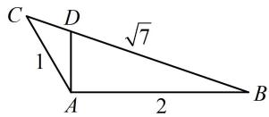

> [!faq]- 《1正余弦定理基础模型》参考答案
>
> > [!success]- **【答案】** 详见解析
>
> > [!note]- **【分析】**
> > 本题未单列分析。
>
> > [!note]- **【解析】**
> > 所以 $\sin \angle ABC = \frac{AC\cdot\sin\angle BAC}{BC} = \frac{1\times\sin 120^{\circ}}{\sqrt{7}} = \frac{\sqrt{21}}{14}$
> >
> > (2)如图, 因为 $\angle BAC = 120^{\circ}$ , $\angle BAD = 90^{\circ}$ ,
> >
> > 所以 $\angle CAD = 30^{\circ}$ ，（求 $S_{\triangle ADC}$ 还差 $AD$ ，只要求出 $\angle ABC$
> >
> > 就能在 $\triangle ABD$ 中求 $AD$ ， $\angle ABC$ 可放到 $\triangle ABC$ 中来求）
> >
> > 由余弦定理推论， $\cos \angle ABC = \frac{AB^2 + BC^2 - AC^2}{2AB\cdot BC}$
> >
> > $$
> > = \frac {2 ^ {2} + (\sqrt {7}) ^ {2} - 1 ^ {2}}{2 \times 2 \times \sqrt {7}} = \frac {5}{2 \sqrt {7}},
> > $$
> >
> > 所以 $BD = \frac{AB}{\cos\angle ABC} = \frac{4\sqrt{7}}{5}, AD = \sqrt{BD^2 - AB^2} = \frac{2\sqrt{3}}{5},$
> >
> > $$
> > S _ {\triangle A D C} = \frac {1}{2} A C \cdot A D \cdot \sin \angle C A D = \frac {1}{2} \times 1 \times \frac {2 \sqrt {3}}{5} \times \sin 3 0 ^ {\circ} = \frac {\sqrt {3}}{1 0}
> > $$
> >
> > 
