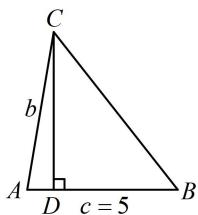

> [!faq]- 《1正余弦定理基础模型》参考答案
>
> > [!success]- **【答案】** 详见解析
>
> > [!note]- **【分析】**
> > 本题未单列分析。
>
> > [!note]- **【解析】**
> > 解: (1) 由题意, $A + B = \pi - C = 3C$ , 所以 $C = \frac{\pi}{4}$ ,
> >
> > （要求的是 $\sin A$ ，故用 $C = \frac{\pi}{4}$ 和 $A + B = \frac{3\pi}{4}$ 将 $2\sin (A - C)$
> >
> > $=\sin B$ 消元，把变量统一成 A)
> >
> > 由 $A + B = 3C = \frac{3\pi}{4}$ 可得 $B = \frac{3\pi}{4} - A$
> >
> > 代入 $2\sin (A - C) = \sin B$ 可得 $2\sin \left(A - \frac{\pi}{4}\right) = \sin \left(\frac{3\pi}{4} - A\right)$ ，
> >
> > 所以 $2\left(\sin A\cos \frac{\pi}{4} -\cos A\sin \frac{\pi}{4}\right) = \sin \frac{3\pi}{4}\cos A - \cos \frac{3\pi}{4}\sin A$
> >
> > 整理得： $\cos A = \frac{1}{3}\sin A$
> >
> > 代入 $\sin^2 A + \cos^2 A = 1$ 可得 $\sin^2 A + \frac{1}{9}\sin^2 A = 1$
> >
> > 所以 $\sin A = \pm \frac{3\sqrt{10}}{10}$ ，结合 $0 < A < \pi$ 可得 $\sin A = \frac{3\sqrt{10}}{10}$ .
> >
> > （2）设内角 $A$ ， $B$ ， $C$ 的对边分别为 $a$ ， $b$ ， $c$
> >
> > 则 $c = AB = 5$ ，如图，作 $CD\bot AB$ 于点 $D$
> >
> > 则 $AB$ 边上的高 $CD = b\sin A = \frac{3\sqrt{10}}{10} b$ ①，
> >
> > (接下来求 b. 已知 A, C 可用内角和为 $\pi$ 求 B, 题干又
> >
> > 给了 $c$ , 故已知三角一边, 用正弦定理求 $b)$
> >
> > $\sin B = \sin \left( \frac{3\pi}{4} - A \right) = \frac{\sqrt{2}}{2}\cos A + \frac{\sqrt{2}}{2}\sin A = \frac{2}{\sqrt{5}}$
> >
> > 由正弦定理， $\frac{b}{\sin B} = \frac{c}{\sin C}$ ，所以 $b = \frac{c\sin B}{\sin C} = 2\sqrt{10}$
> >
> > 代入①得 $CD = \frac{3\sqrt{10}}{10}\times 2\sqrt{10} = 6$ ，故 $AB$ 边上的高为6.
> >
> > 
