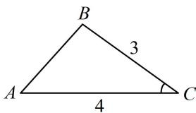

> [!faq]- 《1正余弦定理基础模型》例题解析
>
> > [!success]- **【答案】** A
>
> > [!note]- **【分析】**
> > 本题未单列分析。
>
> > [!note]- **【解析】**
> > 解析：已知两边及夹角，不便使用正弦定理，故先由余弦定理求第三边，
> >
> > 由余弦定理， $AB^{2} = AC^{2} + BC^{2} - 2AC\cdot BC\cdot \cos C = 16 + 9 - 2\times 4\times 3\times \frac{2}{3} = 9$ ，所以 $AB = 3$
> >
> > 已知三边了，可由余弦定理推论求 $\cos B$ ，
> >
> > 如图， $\cos B = \frac{AB^2 + BC^2 - AC^2}{2AB\cdot BC} = \frac{9 + 9 - 16}{2\times 3\times 3} = \frac{1}{9}.$
> >
> >
> > 
