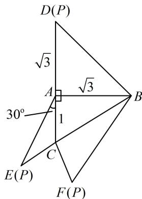
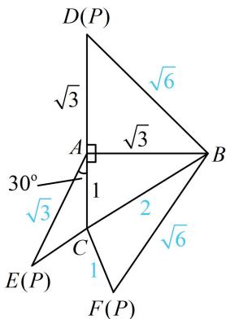

> [!faq]- 《1正余弦定理基础模型》例题解析
>
> > [!success]- **【答案】** $-\frac{1}{4}$
>
> > [!note]- **【分析】**
> > 本题未单列分析。
>
> > [!note]- **【解析】**
> > 解析：先将已知条件标注在图形上，如图1，要求的是 $\cos \angle FCB$ ，所以尽量把条件往 $\triangle FCB$ 上化， $BC$ 可直接在 $\triangle ABC$ 中由勾股定理求得，因为 $AB = \sqrt{3}$ ， $AC = 1$ ， $AB\bot AC$ ，所以 $BC = \sqrt{AB^2 + AC^2} = 2$
> >
> > 由折叠过程可知 $FB = BD$ ，而 $BD$ 可在 $\triangle ABD$ 中由勾股定理求，
> >
> > 在 $\triangle ABD$ 中， $BD = \sqrt{AB^2 + AD^2} = \sqrt{6}$ ，所以 $FB = \sqrt{6}$
> >
> > 只要再求出 $CF$ ， $\triangle FCB$ 就已知三边，可由余弦定理推论求 $\cos \angle FCB$ ，根据折叠过程， $CF = CE$ ，我们发
> >
> > 现 $\triangle ACE$ 已知两边及夹角, 刚好可以用余弦定理求 $CE$ ,
> >
> > 在 $\triangle ACE$ 中，由折叠过程知 $AE = AD = \sqrt{3}$
> >
> > 由余弦定理， $CE^2 = AC^2 +AE^2 -2AC\cdot AE\cdot \cos \angle CAE = 1$
> >
> > 所以 CE=1，故 CF=CE=1，
> >
> > 在 $\triangle FCB$ 中，由余弦定理推论，
> >
> > $$
> > \cos \angle F C B = \frac {C F ^ {2} + B C ^ {2} - F B ^ {2}}{2 C F \cdot B C} = \frac {1 + 4 - 6}{2 \times 1 \times 2} = - \frac {1}{4}.
> > $$
> >
> >
> > 
> >
> >   
> > 图1  
> > 图2
