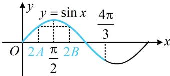

> [!faq]- 《2三角恒等式的常见变形》例题解析
>
> > [!success]- **【答案】** C
>
> > [!note]- **【分析】**
> > 本题未单列分析。
>
> > [!note]- **【解析】**
> > A. $\frac{\sqrt{3}}{2}$ B. 1    C. $\sqrt{3}$ D. 2
> >
> > 解析：题干给出 $a^2 + b^2 - ab = c^2$ 这个式子，联想到余弦定理推论，
> >
> > $a^2 + b^2 - ab = c^2 \Rightarrow a^2 + b^2 - c^2 = ab$ ，所以 $\cos C = \frac{a^2 + b^2 - c^2}{2ab} = \frac{ab}{2ab} = \frac{1}{2}$ ，结合 $0 < C < \pi$ 可得 $C = \frac{\pi}{3}$ ，
> >
> > 再看 $a \cos A = b \cos B$ ，用余弦定理推论化边的后续式子显然偏麻烦，而两边都有边，故考虑用正弦定理边化角， $a \cos A = b \cos B \Rightarrow \sin A \cos A = \sin B \cos B \Rightarrow \sin 2A = \sin 2B$ ，要分析 $A, B$ 的关系，需先研究角的范围，因为 $C = \frac{\pi}{3}$ ，所以 $A + B = \pi - C = \frac{2\pi}{3}$ ，从而 $A, B$ 都在 $\left(0, \frac{2\pi}{3}\right)$ 上，故 $2A, 2B$ 都在 $\left(0, \frac{4\pi}{3}\right)$ 上，结合 $\sin 2A = \sin 2B$ 可得 $2A = 2B$ 或 $2A + 2B = \pi$ （如图），
> >
> > 若 $2A + 2B = \pi$ ，则 $A + B = \frac{\pi}{2}$ ，与 $A + B = \frac{2\pi}{3}$ 矛盾，舍去，
> >
> > 所以 $2A = 2B$ ，从而 $A = B = \frac{\pi}{3}$ ，故 $\triangle ABC$ 是边长为2的正三角形，所以 $S_{\triangle ABC} = \frac{1}{2}\times 2\times 2\times \sin 60^{\circ} = \sqrt{3}$
> >
> > 
