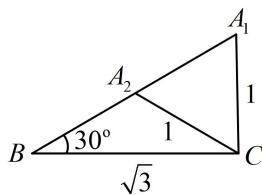

> [!faq]- 《3角的取舍》例题解析
>
> > [!success]- **【答案】** C
>
> > [!note]- **【分析】**
> > 本题未单列分析。
>
> > [!note]- **【解析】**
> > 解析：已知的和要求的合在一起，是两边两对角，可用正弦定理建立方程求 $A$ 由正弦定理， $\frac{a}{\sin A} = \frac{b}{\sin B}$ ，所以 $\sin A = \frac{a\sin B}{b} = \frac{\sqrt{3}\sin 30^{\circ}}{1} = \frac{\sqrt{3}}{2}$ 又 $0^{\circ} < A < 180^{\circ}$ ，所以 $A = 60^{\circ}$ 或 $120^{\circ}$
> >
> > 
>
> > [!tip]- **【反思】**
> > 本题由于 $a > b$ ，所以 $A > B$ ，故 $A$ 可取锐角或钝角，两个都不能舍，两种情况的图形如图所示，其中顶点 $A$ 可以在 $A_{1}$ 或 $A_{2}$ 处.
