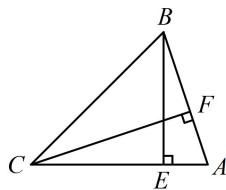

> [!faq]- 《1解三角形中的化角类问题》参考答案
>
> > [!success]- **【答案】** $\left(\frac{1}{2}, 2\right)$
>
> > [!note]- **【分析】**
> > 本题未单列分析。
>
> > [!note]- **【解析】**
> > 解析：已知的等式中有 $\cos^{2}B$ 和 $\cos^{2}A$ ，可先将其化为正弦，以便于角化边，
> >
> > 因为 $\sin B\sin C + \cos^{2}B = \sin^{2}C + \cos^{2}A$
> >
> > 所以 $\sin B\sin C + 1 - \sin^2 B = \sin^2 C + 1 - \sin^2 A$
> >
> > 整理得： $\sin^2 B + \sin^2 C - \sin^2 A = \sin B\sin C$
> >
> > 所以 $b^{2} + c^{2} - a^{2} = bc$ ，故 $\cos A = \frac{b^2 + c^2 - a^2}{2bc} = \frac{bc}{2bc} = \frac{1}{2}$
> >
> > 又 $0 < A < \pi$ ，所以 $A = \frac{\pi}{3}$ ，有了 $A$ ，则 $\triangle ABC$ 的内角可统一，故考虑把 $\frac{BE}{CF}$ 用 $\triangle ABC$ 的内角表示出来，
> >
> > 如图，在 $\triangle ABE$ 中， $BE = AB\cdot \sin A = c\sin A$
> >
> > 在 $\triangle ACF$ 中， $CF = AC\cdot \sin A = b\sin A$
> >
> > 所以 $\frac{BE}{CF} = \frac{c\sin A}{b\sin A} = \frac{c}{b} = \frac{\sin C}{\sin B} = \frac{\sin(\pi - A - B)}{\sin B}$
> >
> > $$
> > = \frac {\sin \left(\frac {2 \pi}{3} - B\right)}{\sin B} = \frac {\frac {\sqrt {3}}{2} \cos B + \frac {1}{2} \sin B}{\sin B} = \frac {\sqrt {3}}{2 \tan B} + \frac {1}{2},
> > $$
> >
> > 因为 $\triangle ABC$ 是锐角三角形，所以 $\left\{ \begin{array}{l}0 < B < \frac{\pi}{2}\\ 0 < C = \frac{2\pi}{3} -B <   \frac{\pi}{2} \end{array} \right.$
> >
> > 解得： $\frac{\pi}{6} < B < \frac{\pi}{2}$ ，故 $\tan B > \frac{\sqrt{3}}{3}$
> >
> > 所以 $0 < \frac{1}{\tan B} < \sqrt{3}$ ，故 $\frac{1}{2} < \frac{\sqrt{3}}{2\tan B} + \frac{1}{2} < 2$ ，即 $\frac{1}{2} < \frac{BE}{CF} < 2$ 。
> >
> > 
>
> > [!tip]- **【反思】**
> > 本题将 $\frac{BE}{CF}$ 化为 $\frac{c}{b}$ 是核心，当我们要求范围的目标不是直接的边角代数式时，也可以考虑先用边角来表示它，再求范围.
