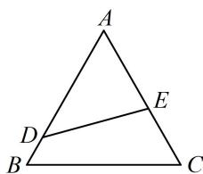

<!-- question-source:start -->
【变式1】如图，公园里有一块边长为4的等边三角形草坪（记为 $\triangle ABC$ ），图中 $DE$ 把草坪分成面积相等的两部分， $D$ 在 $AB$ 上， $E$ 在 $AC$ 上，如果要沿 $DE$ 铺设灌溉水管，则水管的最短长度为（）A. $2\sqrt{2}$ B. $\sqrt{2}$ C. 3 D. $2\sqrt{3}$

<!-- question-source:end -->

![[高中/总复习/教辅/一数常规版2026/第5章 解三角形/模块2：代数问题篇/2解三角形中的化边类问题/类型02_余弦定理化边与不等式综合/例题/answers/Q00050257A1.md]]
